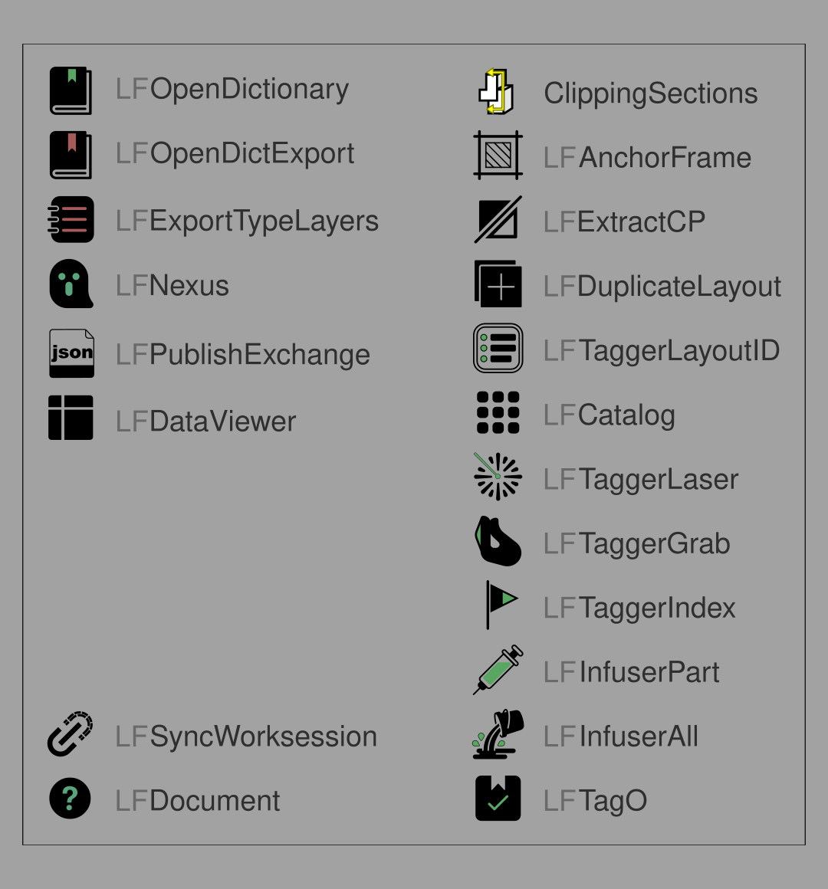

# LoopFlow 2.0 指令逐項說明

> 本文件逐一說明 LoopFlow 2.0 的 Rhino 指令。整體流程與各步驟的關係見 [使用說明總覽](./USER_GUIDE_TW.md)；Excel 字典欄位見 [字典使用說明](./Dictionary_GUIDE_TW.md)；Tag 圖塊的畫面欄位見 [Tag Block 說明](./TAG_BLOCKS_TW.md)。
>
> 指令名稱使用封裝後在 Rhino 命令列輸入的正式名稱（無底線）。

## 專案資料夾原則

開始操作前先把 `.3dm` 存檔。**`.3dm` 所在資料夾就是專案工作資料夾**：正式 Dictionary 與 `.3dm` 同層，專案設定、Registry 與 log 放在同層的 `_LoopFlow_Config/loopflow/`。整包搬到其他上層目錄、磁碟或電腦仍可使用；LoopFlow 不依賴某台電腦的固定絕對路徑。官方 Dictionary 範本與 `Tag_Blocks.3dm` 在執行產品指令時會出現在「文件\LoopFlow」。若安裝版號變了，該資料夾的官方檔會換成與套件相同的版本，再複製到專案資料夾使用。

## 快速索引



| 階段 | 指令 | 一句話 |
|---|---|---|
| 字典 | `LFOpenDictionary` | 開啟正式 Excel 字典 |
| 字典 | `LFOpenDictExport` | 開啟從模型匯出的字典，供人工核對 |
| 字典 | `LFExportTypeLayers` | 把 Rhino 圖層現況匯出成字典，供核對用 |
| 開案／模型 | `LFNexus` | 開案主控台：把字典資料寫入模型（6 步選單） |
| Registry | `LFPublishExchange` | 把模型資料發布成 2D 可讀的 Registry |
| 剖面 | Rhino Section（原生） | 用 Rhino 內建剖面工具產生圖面 |
| View | `LFAnchorFrame` | 把剖面登記成固定的 2D↔3D 對應（錨定框） |
| Drawing | `LFExtractCP` | 把剖面線稿複製成可獨立編輯的圖面 |
| Sheet | `LFDuplicateLayout` | 複製整份 Layout，通常在編號前使用 |
| Sheet | `LFTaggerLayoutID` | 依規則自動編排圖號、圖名 |
| Catalog | `LFCatalog` | 建立圖目錄（只讀 Sheet 資料） |
| Tag 綁定 | `LFTaggerLaser` | 用滑鼠點位置＋固定投影方向自動找來源物件 |
| Tag 綁定 | `LFTaggerGrab` | 直接點選來源物件或家具圖塊 |
| Tag 綁定 | `LFTaggerIndex` | 把索引類 Tag 綁定到已登記的 Detail |
| 資料注入 | `LFInfuserPart` | 把資料注入**目前這一頁**的 Tag 顯示欄 |
| 資料注入 | `LFInfuserAll` | 把資料注入**全部頁面**的 Tag 顯示欄 |
| 健康檢查 | `LFTagO` | 正常／過期／斷連，只上色不修復 |
| 協作 | `LFSyncWorksession` | 監看同資料夾檔案異動，自動 Refresh Worksession |
| 查詢 | `LFDataViewer` | 點物件唯讀查看現有資料 |
| 文件 | `LFDocument` | 開啟 LoopFlow 的公開文件入口 |
| 介面 | `LFLanguage` | 切換 English／正體中文，記在這台電腦 |

Laser、Grab、Index 是三種不同的 Tag 綁定方式，依來源狀況擇一或並用，不必三支都跑。Infuser Part 與 All 是同一動作的不同範圍，擇一即可。

## 目錄

**主工作鏈**：[01 開啟正式字典](#01-開啟正式字典) · [02 開啟匯出字典](#02-開啟匯出字典) · [03 匯出字典](#03-匯出字典) · [04 Nexus](#04-nexus開案主控台) · [05 發布串接資料](#05-發布串接資料) · [Rhino Section](#rhino-section原生) · [06 註冊 View](#06-註冊-view錨定框) · [07 圖號命名](#07-圖號命名) · [08 圖目錄](#08-圖目錄) · [09 雷射投影](#09-雷射投影) · [10 直接抓取](#10-直接抓取) · [11 對應視圖](#11-對應視圖) · [12/13 注入資料](#1213-注入資料) · [14 健康檢查](#14-健康檢查tag-o)

**輔助工具**：[A1 雙機同步](#a1-雙機同步) · [A2 資料檢視](#a2-資料檢視) · [A3 擷取線稿](#a3-擷取線稿) · [A4 複製 Layout](#a4-複製-layout) · [A5 使用說明](#a5-使用說明) · [A6 切換介面語言](#a6-切換介面語言)

---

## 01　開啟正式字典

**指令**：`LFOpenDictionary`

用系統預設的 Excel 開啟這份專案記住的正式字典檔（預設檔名 `LoopFlow_Dictionary.xlsx`）。檔名記在 `.3dm` 旁的 `_LoopFlow_Config/loopflow/LoopFlow_Project.json`；指令只負責開檔，不編輯、不建立檔案。

- 正式字典還沒指定過時，請先跑 [04 Nexus](#04-nexus開案主控台) 的「同步 Type Layers」選一次檔。
- 開啟後如何看懂欄位，見 [字典使用說明](./Dictionary_GUIDE_TW.md)。

## 02　開啟匯出字典

**指令**：`LFOpenDictExport`

開啟同一個資料夾裡、由 [03 匯出字典](#03-匯出字典) 產生的 `{原檔名}_Export.xlsx`。這份檔案只給人核對，**不能當正式字典使用、也不會覆寫正式字典**。

- 匯出檔還不存在時，請先跑 03。

## 03　匯出字典

**指令**：`LFExportTypeLayers`

把 Rhino 模型目前圖層現況，反向匯出成一份 Excel（例如正式檔是 `LoopFlow_Dictionary.xlsx`，就會產生 `LoopFlow_Dictionary_Export.xlsx`），方便對照模型跟正式字典有沒有差異。

**匯出檔的內容**：

- 第一列是紅字提示：這份檔案不能當正式字典開啟，也不可以覆蓋正式檔。提示語系、15 欄欄名與字型跟著**來源字典**，不跟介面語言。繁中來源寫 `_03_ID編號`、微軟正黑體；英文來源寫 `_03_Type ID`、Arial。
- 欄位跟正式字典一樣的 15 欄，多一欄 `diff_status`，用顏色標示差異：
  - **紅字**：正式字典有、模型裡卻不見的圖層（`missing_in_rhino`）。
  - **藍字**：模型裡新增、字典還沒有的圖層（`added_in_rhino`）。放在表格最下面；併回正式字典時記得給一個**還沒用過的** Type ID，不要沿用舊編號。
  - **橙字**：兩邊都有，但內容不一樣（`modified`）。
  - 沒變的維持黑字（`unchanged`）。

只核對圖層層級的預設值，不會彙整物件上個別的資料。核對完由使用者自己手動把需要的修改抄回正式字典。

### 字典校對迴圈

03 → 02 → 01 是一個核對迴圈，不是三個各自獨立的工具：03 先匯出模型現況，02 打開來看，人工比對後手動回頭修改 01（正式字典）。只有 01 會被 [04 Nexus](#04-nexus開案主控台) 讀取；02、03 本身不會直接餵資料給 04。

---

## 04　Nexus（開案主控台）

**指令**：`LFNexus`

LoopFlow 的資料中樞。第一次執行會先做「開案檢查」，通過後才會出現以下 6 步選單（可重複執行，不必照順序跑完，但後面的步驟通常要先完成前面的）：

```text
1  開案檢查
2  從字典同步 Type Layers
3  登記高程框（封閉曲線）
4  登記空間框（封閉曲線，須在高程框內）
5  寫入模型 Metadata
6  檢核模型 Metadata（不寫入）
```

### 1　開案檢查

自動確認 `.3dm` 已存檔，並以它所在資料夾解析 Dictionary、`_LoopFlow_Config/loopflow/LoopFlow_Project.json`、`project_id`、資料版本與 Rhino 文件單位。

- 第一次執行若設定檔還沒有 schema，會補上 `loopflow.project`／`1`；尚未填專案名稱時仍可進選單，請在步驟 2 填寫。
- 設定檔無法解析或 schema 版本未知時會停止，不會亂猜內容。
- 文件單位不是 cm 不會擋，但會明確警告並建議切成 cm。
- 找不到字典檔不會擋住選單，只會警告，之後用步驟 2 指定即可。

### 2　從字典同步 Type Layers

把正式字典的內容同步到 Rhino 圖層：

- 每次同步都會詢問「專案名稱」（圖層前綴）。第一次不預填；尚未設定時的標準建議為 `M3D`。確認過一次後，後續會預填上次記住的名稱，仍可人工修改。專案名稱同時是 Registry 子資料夾名，記在 `LoopFlow_Project.json`。
- 第一次會跳出選 Excel 檔的視窗；Dictionary 必須和 `.3dm` 在同一層。選定後只記住檔名，之後不會再問。
- 若記住的檔案被改名或移走，會先說明請把 Dictionary 放回 `.3dm` 同一層，再從該資料夾重新選取；選到其他資料夾時會說明並再問，不會把外部路徑寫進專案。
- 字典有、Rhino 沒有的圖層：自動建立，並帶入預設值。
- Rhino 已經有的同名圖層：保留既有 UserText 與建構狀態；顯示顏色仍依 Type 分類重新套用。
- 不會動到物件上個別的資料，也不會把物件現況寫回字典。

### 3　登記高程框（封閉曲線）

選一條封閉曲線，代表某個樓層的地坪基準。跳出清單先選 `FFL`（完成地坪）或 `FL`（樓板結構），再輸入數字高程（例如 `0`、`320`）。

### 4　登記空間框（封閉曲線，須在高程框內）

選一或多條封閉曲線，代表空間範圍，並輸入同一個空間名稱。空間框的高程必須落在某個高程框 ±20 模型單位以內，且整圈都在高程框裡面（共邊可以）。

- 面積互相重疊時會停下來，列出所有衝突的空間，讓使用者自己決定怎麼改，不會自動選一個。
- 同一樓層的房間會自動對應到同一個高程框，不必手動填樓層編號。

### 5　寫入模型 Metadata

**前置**：高程框（3）與空間框（4）都要先登記好，否則會直接擋下不寫入。

把一般物件的 ID、材質對照、所在空間、高程、資料版次寫進物件屬性。如果一個物件同時落在兩個空間框裡，會依序把畫面拉近該物件，再彈出清單讓使用者選一個所屬空間。

**`00_STR` 結構層與其子層不寫入、不問空間。** 同一輪會清掉這些物件上既有的物件資料。Type 圖層與圖層 `lf_type_id` 仍會建立。結構層物件也不列入步驟 6 的不符清單，也不進 Registry。

### 6　檢核模型 Metadata（不寫入）

在記憶體裡重新算一次「如果現在寫入會得到什麼」，跟物件現況比對，**不會真的寫入**。

- 完全相符：彈窗說明沒問題。
- 不相符：彈窗列出差異，並提醒「請執行步驟 5 寫入模型 Metadata」，同時自動選取那些有問題的物件。

---

## 05　發布串接資料

**指令**：`LFPublishExchange`

**前置**：04 的檢核（步驟 6）要先通過。局部選取的物件不能發布，只能整案發布。

把模型資料打包成一份新的 Registry（提供給 2D 端使用的唯讀資料快照）。正式檔位於 `.3dm` 同層的 `_LoopFlow_Config/loopflow/<專案名稱>/Project_Registry.json`：

1. 取得專屬鎖定（避免跟別人同時發布衝突）。
2. 重新讀取現況、版次加一。
3. 先寫暫存檔並完整驗證，驗證通過才正式取代舊檔（不會半途留下壞掉的正式檔）。
4. 成功後，正式範圍內物件的「資料版次」欄位會更新成這次發布的版次。

失敗時會保留上一份成功的正式資料（last-good），不會刪掉重來；彈窗會列出跟步驟 6 相同的不符清單，並自動選取相關物件。

---

## Rhino Section（原生）

不是 LoopFlow 的指令，是 Rhino 8 內建的 `Section`／`Clipping` 系列指令，用來產生剖面、立面或平面圖。LoopFlow 不取代這一步，只在下一步把產出結果登記起來。

---

## 06　註冊 View（錨定框）

**指令**：`LFAnchorFrame`

把一個剖面登記成固定的 2D↔3D 對應，供 [09 雷射投影](#09-雷射投影) 定位使用。

**操作位置**：**2D 模型空間**（不是 Layout）。

1. 框選該剖面的線稿／圖塊／填充，以及**恰好一個** Text Dot（文字要能對到 Clipping Plane 名稱）。
2. 彈出視窗輸入框線的外擴距離（預設 50）。
3. 系統先以 Text Dot 文字尋找完整同名的 Clipping Plane（不分大小寫）。若沒有完整同名，才允許名稱較長且包含該文字的唯一候選；候選不唯一時停止、不猜測。
4. 新的框會畫在 `LoopFlow::Anchor_Frame` 圖層。如果選到的是舊版（1.x）已經登記過的框，會直接升級那個框，不會另外多畫一條。

一個剖面只登記一次。之後只要**框跟圖一起平移**（沒有重新剖切、旋轉或鏡射），就不必重跑這個指令。天花反射平面要先把圖左右鏡射過再登記。

---

## 07　圖號命名

**指令**：`LFTaggerLayoutID`

依規則自動編排整份檔案的 Layout 圖號與圖名，並建立「Sheet metadata」（圖號、圖名、系列的真正資料來源；Layout 頁名只是顯示結果）。

### 命名格式

系列起點與手動頁都用同一種三欄格式：

```text
**圖類別__圖號__圖名        ← ** 開頭：自動編號的起點
//圖類別__圖號__圖名        ← // 開頭：手動頁，不參與自動編號
```

- `**` 只加在每個系列的**第一頁**最前面，執行後會保留，不要刪掉。
- `//` 開頭的頁不佔號，但仍要維持完整三欄格式。
- 圖號只要**尾端是數字**就可以：`201`、`101.01`、`101.1`、`A01` 都合法，不強制要 `.01`。

### 自動編號怎麼算

從頁序由上往下掃：遇到 `**` 開頭，該系列從那個圖號起算；接下來每一頁只把**尾端數字 +1**，直到遇到下一個 `**`。例如：

| 目前 | 下一頁 |
|---|---|
| `201` | `202` |
| `101.9` | `101.10`（進位不加前導零） |
| `A09` | `A10` |

整份檔案裡如果一個 `**` 都沒有（也沒有合法的 `//`），指令會停止並只顯示命名規則說明，不會亂猜。

### 怎麼跑

1. 每個系列的第一頁改成 `**圖類別__圖號__圖名`，後面的頁只要改圖名（第三欄）就好；不編號的頁用 `//圖類別__圖號__圖名`。
2. 執行指令。若跳出圖框清單，**只勾選真正的圖框**（例如 `_Frame_A3_shop_drawing`），標記用的 `tag_*` 圖塊不要勾——清單預設全部不勾。
3. 系統顯示核對清單（原始名稱／修改後名稱／狀態，順序跟 Layout 列表一樣），確認後才會真的寫入；取消就整批不寫。
4. 寫入內容：Layout 頁名整理成三欄、圖框寫入圖號與圖名、`TAG_ELEV_0` 寫入本頁圖號，文件裡建立 Sheet metadata。**比例（`lf_scale`）由人工自己填，這個指令不會動它。**

一頁沒有圖框、或有兩個以上圖框，該頁會跳過並在報告裡列出，不會擋住其他頁。**插頁或改頁序後要重新跑一次**，圖號才會照新順序重排；沒重跑的話，圖目錄等會讀到這份資料的功能應該要回報「過期」，不能安靜地顯示舊值。

---

## 08　圖目錄

**指令**：`LFCatalog`

**前置**：07 已經建立過 Sheet metadata。

只讀取 Sheet metadata 來產生圖目錄文字，不會自己重新解析頁面內容。面板有六個動作：

1. 「選取圖號定位點」：選一組獨立 Point 作為圖號格；點會變紅並移到 `LoopFlow::Drawing_Number`。
2. 「選取圖名定位點」：選另一組獨立 Point 作為圖名格；點會變綠並移到 `LoopFlow::Drawing_Name`。兩組共同構成圖目錄網格。
3. 「選取 Layout」：在清單裡選要列入的頁面（依頁序／圖號／圖名／頁名四欄顯示，可用 Shift 連選、Ctrl 加選）。
4. 「生成 圖號/圖名」：預覽並更新目錄。新文字以定位點左下角為原點，預設放在 `LoopFlow::Drawing_Text`；既有文字只更新內容，**不會被拉回定位點**。生成前會把每一格既有文字的字型、字高、圖層與顏色記回定位點；日後中間頁刪除、重新綁定或文字被刪掉再重建時，仍沿用該格記住的外觀。
5. 「清除定位點並還原圖層」：清掉目錄資料、刪除產生文字，並把點放回選取前的圖層。
6. 「匯出 TXT」：輸出目前目錄文字。

定位點只記住「這一格對應哪個 Sheet」與該格文字外觀，不保存圖號、圖名的實際內容，也不保存頁名，所以定位點的數量可以比實際 Layout 多（例如 40 格只用 28 張圖）。生成、清除或匯出成功後面板會關閉；三個選取動作完成後面板會保持開啟。面板**沒有 Refresh，也沒有另外的關閉按鈕**，避免只更新內容時誤刪已移除頁面的格子文字且無法復原。

---

## 09　雷射投影

**指令**：`LFTaggerLaser`

用「在畫面上點一下」的方式，讓系統沿著固定的投影方向自動找出剖面對應的模型物件，寫入來源綁定。

1. 在 **Layout** 選取 Height 或 Finish 的 Laser Tag。
2. 在目標 Detail 內點一下剖面上的位置——**這個點必須落在 [06 註冊 View](#06-註冊-view錨定框) 已經登記好的錨定框內**，否則會提示先做 06。
3. 系統以框內剖面線稿現況的中心點當 2D 原點，沿著登記時寫死的方向射線找物件；同一個物件只算一次。若射線命中多個物件，會列出候選清單（只顯示圖層名稱，不顯示物件 ID），由使用者選擇正確來源。

**不會寫入的情況**：按 Esc、點在 Detail 外面、Tag 被鎖定、選錯圖塊種類（Grab／Index／`TAG_DW`／圖框）、同時對到 0 個或 2 個以上的登記框、射線沒打到任何東西（含只打到結構體）、來源物件沒有可用的識別碼。

日常操作不會畫出測試用的射線；如果想確認方向，在**選 Tag 的當下**命令列會出現 `DebugRay` 選項，切成 `Yes` 才會畫出洋紅色的除錯線（不會被列印）。

---

## 10　直接抓取

**指令**：`LFTaggerGrab`

不靠投影，直接點選來源物件，適合剖面線稿已經很清楚、或要綁定家具圖塊的情況。

1. 在 **Layout** 選取 Tag。
2. 點進目標 Detail，進入模型空間。
3. 直接選來源：剖面 2D 線、3D 物件，或家具圖塊。

- Height／Finish 類的 Tag 會綁定物件的識別碼。結構體不當來源，零寫入。
- 家具（Item）類的 Tag 會綁定**圖塊名稱**（例如 `FF-01__Chair-1`）**以及該實例本身**——這樣之後改圖塊名稱或刪除該實例，[12/13 注入資料](#1213-注入資料) 與 [14 健康檢查](#14-健康檢查tag-o) 才能跟得上變化。同款家具可以共用同一個圖塊名稱。**`TAG_ITEM` 與要抓的家具圖塊必須在同一個 `.3dm`**；2D／3D 分成兩個檔再用 `.rws` 連結時，不能從出圖檔去點 3D 連結檔裡的家具。

**不會寫入的情況**：按 Esc、點在 Detail 外面、Tag 被鎖定、選錯圖塊種類（Laser／Index／`TAG_DW`／圖框）、來源找不到可用的識別碼。結束後會自動回到 Layout。

---

## 11　對應視圖

**指令**：`LFTaggerIndex`

把「索引類」Tag（例如剖面詳圖索引、立面方向索引）綁定到已經登記好的 View（也就是某個 06 錨定框對應的剖面）。

1. 在 **Layout** 選取 `TAG_SECTION_DETAIL` 或 `TAG_ELEV_1`～`4`。
2. 從一份可搜尋的清單裡選全檔案任一 Layout 的 Detail（顯示「頁名＋Detail 名」，點選時會自動跳頁並拉近畫面）。
3. 用該 Detail 模型空間的中心點去對已登記的 View 框，**恰好對到一個**才會寫入綁定，並記下所選的頁名，供之後 Infuser 找圖號用。

**不會寫入的情況**：按 Esc、Tag 被鎖定、選錯圖塊種類、目前不在 Layout、該頁沒有 Detail、同時對到 0 個或 2 個以上的 View、取消清單。

> 提醒：`TAG_ELEV_0`（六方向索引牌）不是這支指令綁定的對象；方向欄位由人工填寫，本頁圖號由 [07 圖號命名](#07-圖號命名) 寫入。

---

## 12/13　注入資料

**指令**：`LFInfuserPart`（目前這一頁）／`LFInfuserAll`（全部頁面）

把 05 發布出來的 Registry 資料與 07 建立的 Sheet metadata，寫進已經綁定好的 Tag 畫面顯示欄。兩支指令規則完全相同，差別只在處理範圍：

- **`LFInfuserPart`**：只處理目前這一頁（含標在該頁 Detail 圖上的 Tag）。適合改完一頁就想立刻看到結果。
- **`LFInfuserAll`**：一次處理全檔所有 Layout 頁，也可以在模型空間執行。適合大範圍更新之後統一整理。

行為重點：

- Height／Finish 的材質、高程等欄位，會先對發布出來的 Registry 資料；對不到才退而讀模型上物件現況的 UserText。
- 家具 Tag 如果先前有記下實例，會讀該實例**目前**的圖塊名稱——改名會自動更新畫面；如果該實例被刪除，會顯示斷連（`?`，整顆塗紅）。
- 已經被 [14 健康檢查](#14-健康檢查tag-o) 標記「斷連」的 Tag，這支指令**不會**把資料灌回去——要先重新綁定（回到 09／10／11），下一次注入才會恢復。
- 鎖定的 Tag、`TAG_DW`、圖框、`TAG_ELEV_0`，以及所有人工手填欄位（備註、Detail 編號、立面方向等）都不會被覆蓋。
- 沒有綁定的欄位顯示 `-`，不會塗警示色。
- 執行完會彈出摘要，說明這次處理了什麼。

---

## 14　健康檢查（TAG-O）

**指令**：`LFTagO`

在跑過 12／13 之後，檢查每一顆已綁定 Tag 的狀態，開啟一個可捲動的深色面板，依 Layout 頁序列出（頁與頁之間有灰線分隔）：

| 狀態 | 顏色 | 畫面自動欄 | 意思 |
|---|---|---|---|
| 正常 | 綠 | 不變 | 來源還在，資料是最新的 |
| 過期 | 橘 | `!`，整顆塗橘 | 來源還在，但畫面資料不是最新的——只需重新跑 12／13 |
| 斷連 | 紅 | `?`，整顆塗紅 | 來源不見了、目標頁被刪、目標 Detail 被刪——要先重新綁定，再跑 12／13 |

- 只列出**已經綁定過**的 Tag；沒綁定的（畫面是 `-`）不列出，也不塗警示色。
- 點選清單裡的一列，畫面會反白該列、切到對應的 Layout 頁並拉近（留出圖框周圍空間）。
- 鎖定的 Tag 仍然會列出並標註「鎖定」，但文字與顏色都不會被改。
- `TAG_DW` 與 `TAG_ELEV_0` 不列入檢查範圍。
- **只檢查與上色，不會自動修好任何東西**——LoopFlow 2.0 沒有自動修復功能，怎麼改由使用者自己判斷。

一輪正常的操作順序：**Infuser 注入 → TAG-O 確認活著或斷連 → 依照結果決定下一輪要重新綁定還是只要重新注入**。

---

## A1　雙機同步

**指令**：`LFSyncWorksession`

供多人／多電腦協作時，讓出圖端能自動看到最新的 3D 參照檔。

- 執行前必須先把目前檔案存到磁碟。
- 第一次執行會彈窗說明「已開始監看」，開始監看**同一個資料夾**裡的 `.3dm` 異動（會略過暫存檔）。
- 偵測到異動、且 Rhino 進入閒置狀態 0.5 秒後，自動執行一次 Worksession Refresh。
- **只做 Refresh，不會自動 Attach 或 Detach** 任何參照，也不會改動 `.rws` 設定檔本身。Grab `TAG_ITEM` 仍須 Tag 與家具圖塊在同一個 `.3dm`，不能點連結檔裡的家具。
- Refresh 失敗會延遲後自動重試，**不會拆掉上一份還有效的參照**。
- 再執行一次會彈窗並停止監看。若檔案被另存到別的資料夾，重新執行會改監看新位置。

## A2　資料檢視

**指令**：`LFDataViewer`

點選任何物件，唯讀顯示它目前的所有 canonical 資料欄位（ID、空間、高程、備註、版次…），方便確認寫入結果或排查問題。

- 完全不會寫入、不會改動物件名稱。
- 缺值會標示為「（缺）」；如果是從舊版欄位讀到的資料，也會標出來源，方便判斷這是不是還沒轉檔完成的舊物件。
- 按 Esc 或 Enter 結束。

## A3　擷取線稿

**指令**：`LFExtractCP`

把 Rhino Section 產生並保留為同步來源的剖面線稿（圖 A），複製成一份可以自由編修的獨立圖面（圖 B）。

**操作位置**：**2D 模型空間**。

1. 勾選剖面根圖層（底下有 Visible／Hatch／Curve 子層的那個）。
2. 複製到 `LoopFlow_Extract` 圖層下，並清掉從 3D／圖 A 帶過來的資料欄位，只留下圖面本身的識別資訊。
3. 如果對應到已經登記的 View，會記下來源與發布版次，供之後判斷資料是否過期。
4. 如果同一個剖面之前已經抽取過，會詢問要**取代**、**新增**還是**略過**——使用者已經手動修改過的圖面不會被取代覆蓋。

抽出來的圖面可以連同 06 的錨定框一起平移，方便跟原圖分開放置；之後 [09 雷射投影](#09-雷射投影) 兩張圖都能用同一個錨定框定位。

## A4　複製 Layout

**指令**：`LFDuplicateLayout`

複製整份 Layout（含 Detail、圖框、Tag），通常在跑 07 圖號命名**之前**使用。

1. 從加高可捲動的清單裡複選來源 Layout（Ctrl／Shift 反白）。
2. 彈窗輸入要複製的份數（1～100，會套用到所有選取的頁）。
3. 用 Rhino API 直接複製整頁，**不會用到系統剪貼簿**。

複製後的行為：

- 除了 `TAG_DW` 之外，**所有 Tag 的來源綁定都會被清掉**，並整顆標成斷連樣式（`?`，塗紅），提醒使用者重新綁定。
- **不會改變 Tag 的鎖定狀態**。
- `TAG_DW` 的人工編號、寬、高等內容完整保留。
- 內建圖框與曾由 07 登錄的專案自訂圖框，都會取得新的 Sheet 身分；圖號、圖名先清空（等重新跑 07 才會填上），比例（`lf_scale`）保留。
- 圖目錄定位點會取得新的目錄身分；若原本綁定來源 Sheet，複本會改綁新 Sheet，避免兩頁共用同一份目錄資料。
- 新頁名保留三欄格式並加上 `_CopyN`，但不會自動加 `**`／`//`，避免被誤認成新的編號系列。

取消、來源沒有物件、或執行失敗，都不會留下複製到一半的頁面。複本要列入 08 圖目錄前，請先重新執行 07 圖號命名。

## A5　使用說明

**指令**：`LFDocument`

開啟 LoopFlow 的公開文件入口網頁（不是專案首頁）。不會修改模型，也不會猜測 Rhino／Windows 的系統語系；打不開時只會說明原因。

## A6　切換介面語言

**指令**：`LFLanguage`（**Document** 工具列按鈕右鍵）

LoopFlow 介面已接上 English／正體中文句子表。第一次執行任一產品指令時會先顯示兩顆選擇鈕：左側 English、右側正體中文；預設為 English，按 Enter 會選英文。按 Esc 或關閉視窗會取消這次指令，不保存選擇，下次執行產品指令時再問。

之後可在 **Document** 按鈕上按右鍵，或直接輸入 `LFLanguage`，再次開啟相同的選擇視窗。語言偏好保存在這台電腦的 `%APPDATA%\LoopFlow\preferences.json`，不會寫進 `.3dm` 或專案的 `_LoopFlow_Config/`；切換後的確認訊息也會使用新語言。

`Tag_Blocks.3dm` 內固定的 `Grab`、`Laser`、`W.`、`H.` 與公式提示屬於圖塊內容，維持英文，不跟著 `LFLanguage` 改變。
