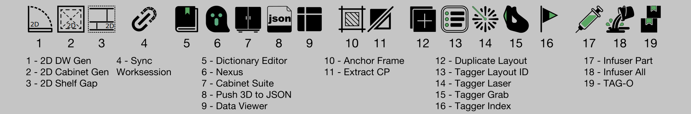

# LoopFlow User Guide

> All LoopFlow commands run in Rhino 8 (CPython 3.9).
> Files prefixed with `_` are internal system modules — do not execute or modify them directly.

Last updated: 2026-04-22

---

## Table of Contents

1. [Main Workflow](#main-workflow)
2. [Standalone Utility Commands](#standalone-utility-commands)
3. [Configuration & System Modules](#configuration--system-modules)

---

## Main Workflow



The following commands have sequential dependencies and should be executed in order.

```
LF_Nexus (set up layers / tag 3D objects)
  → LF_Cabinet_Suite (build cabinet models)
  → LF_Push_3D_to_JSON (push data to registry)
  → [Rhino Section Tools] + LF_Anchor_Frame (generate 2D drawings)
  → LF_Tagger_Layout_ID (assign drawing numbers)
  → LF_Tagger_Laser / LF_Tagger_Grab / LF_Tagger_Index (link Tag Blocks)
  → LF_Infuser_Part / LF_Infuser_All (write data into Tag Blocks)
```

---

### LF_Nexus

The data hub, containing 5 sub-commands:

| Sub-command | Description |
|---|---|
| **Dict. to Layer** | Generate Rhino layers from the dictionary Excel file |
| **SpaceBoundary** | Select closed curves to define space name data |
| **TagTrigger** | Write data from the dictionary into all 3D objects on M3D layers, regardless of layer or object visibility/lock state |
| **TagChecker** | Warns if any 3D object has incorrect or incomplete data. Re-run TagTrigger to fix |
| **Layer to Dict.** | Reverse-export Rhino layers to Excel (LoopFlow_Dictionary_Export.xlsx) as a basis for updating the original dictionary. Layers are always modified during modeling, so you will end up with two Excel files — merge them manually according to your preference |

---

### LF_Cabinet_Suite

Cabinet generator with 30 model combinations, including carcasses, doors, shelves, and BOM dimension data.

BOM Update supports two data-writing modes:

1. **Models generated by LF_Cabinet_Suite** — dimensions are written automatically (models can be on any layer)
2. **Manually built models** — use the BOM Update button to write dimensions (models must be on the `M3D::04_CB` layer)

BOM Update only writes data to objects on the cabinet layer (`M3D::04_CB`); objects on other layers are unaffected. You can safely select all objects when running BOM Update.

> **Note**: Models generated by LF_Cabinet_Suite have a 1mm gap between panels for rendering purposes. BOM automatically compensates for this gap when writing dimensions.

---

### LF_Push_3D_to_JSON

Pushes 3D object data to `Project_Registry.json` (created in the same directory as the .3dm file). All subsequent 2D commands read from this file.

> **Important**: After any changes to 3D models, re-run this command to keep 2D and 3D data in sync.

This command also prompts automatically after TagTrigger completes. If working in a Dropbox folder, the first push may fail due to sync latency — wait a few seconds and re-push when prompted.

---

### [ Rhino 8 Section Tools ] (Rhino Built-in)

The following are Rhino 8 built-in tools, not LoopFlow commands. They generate 2D section drawings used in subsequent LoopFlow steps:

- Create clipping sections
- Create clipping section drawings
- Clear clipping sections
- Edit clipping drawings
- Update clipping drawings

---

### LF_Anchor_Frame

Generates a bounding frame around a selected 2D drawing, used as an anchor by subsequent Tagger commands.

> **This frame must not be deleted.**
> Think of Anchor Frame as a target — Tagger commands aim at this target when linking data. If you move the 2D drawing, the Anchor Frame must move with it.

---

### LF_Tagger_Layout_ID

Automatically assigns drawing numbers to Layouts and writes them into the title block.

Command-line options:

- **Rule** — description of the default numbering system
- **CreateTemplate** — generates `NamingRules_Config.json` in the .3dm directory; edit the file to customize numbering logic, then re-run the command to apply

> The customization options in CreateTemplate may not yet cover all edge cases — feedback is welcome.

---

### LF_Tagger_Laser / LF_Tagger_Grab

Links material, furniture, and door/window Tag Blocks to 2D drawing data, for Infuser to write later.

- **Laser** — laser-positioning mode (suited for section Detail Views)
- **Grab** — click-to-pick mode

> **Write-protection**: A manually locked Tag Block will not be overwritten by Infuser (switches from automatic to manual mode).

---

### LF_Tagger_Index

Links elevation and section Tag Blocks (index tags) to Layout Detail View data, for Infuser to write later.

> Write-protection applies here as well.

---

### LF_Infuser_Part / LF_Infuser_All

Writes data into Tag Blocks. Tag Blocks display one of three states:

| Color | State | Description |
|---|---|---|
| Purple | Linked | Data successfully written |
| Orange | Unlinked | Tagger has not been run yet |
| Red | Broken link | The linked 3D object or Detail View has been deleted |

- **Infuser_Part** — writes only to Tag Blocks in the current Layout
- **Infuser_All** — writes to all Tag Blocks across all Layouts at once

---

## Standalone Utility Commands

The following commands can be used independently at any point in the workflow.

---

### LF_2D_DW_Gen

Quickly generates basic door and window symbols: 8 door styles and 3 window styles.

### LF_2D_Cabinet_Gen

One-click generation of 2D cabinet symbols: tall unit, base unit, wardrobe.

### LF_2D_Shelf_Gap

Quickly generates equally spaced shelf dividers.

### LF_Sync_Worksession

Multi-user collaboration and automatic worksession updates.

### LF_Dictionary_Editor

Opens the dictionary Excel file directly.

> The .3dm and .xlsx files must be in the same directory.
>
> For column reference, authoring rules, and the full data table, see [`Dictionary_GUIDE_EN.md`](./Dictionary_GUIDE_EN.md).

### LF_Data_Viewer

Quickly inspect the UserText data stored on any 3D object.

### LF_Extract_CP

Extracts 2D linework generated by Section Tools into new layers by color, making it easier to select and reassign to target layers.

> **Note**: If you need to move the extracted 2D lines to a different position, the Anchor Frame must move with them — Tagger commands rely on the frame to anchor their target.

### LF_Duplicate_Layout

Duplicates one or more selected Layouts at once.

### LF_TAG-O

Displays the status of all Tag Blocks across the entire file: linked / unlinked / broken.

---

## Configuration & System Modules

### `_LoopFlow_Config.py` — Global Configuration Hub (editable)

Centralizes all customizable constants: layer names, colors, filenames, naming conventions, and more. Changes take effect the next time the relevant script is run in Rhino — no restart required.

### System Modules (do not modify)

| File | Description |
|---|---|
| `_LF_Debug.py` | Exception logger — writes errors to `cursor_LF_debug_log.txt` |
| `_LF_NamingRules.py` | Drawing naming rules engine — customize indirectly via `NamingRules_Config.json`, not by editing this file |
| `_LF_Registry.py` | Read/write bridge for `Project_Registry.json`, with file-lock collision prevention |
