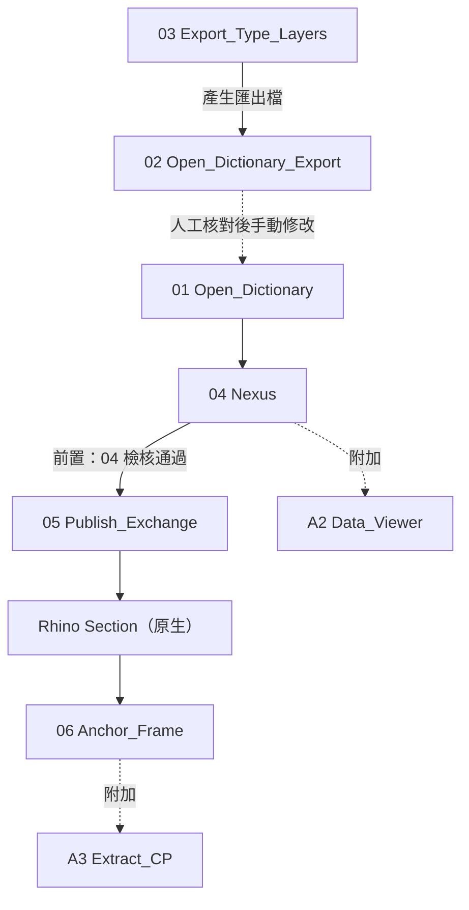
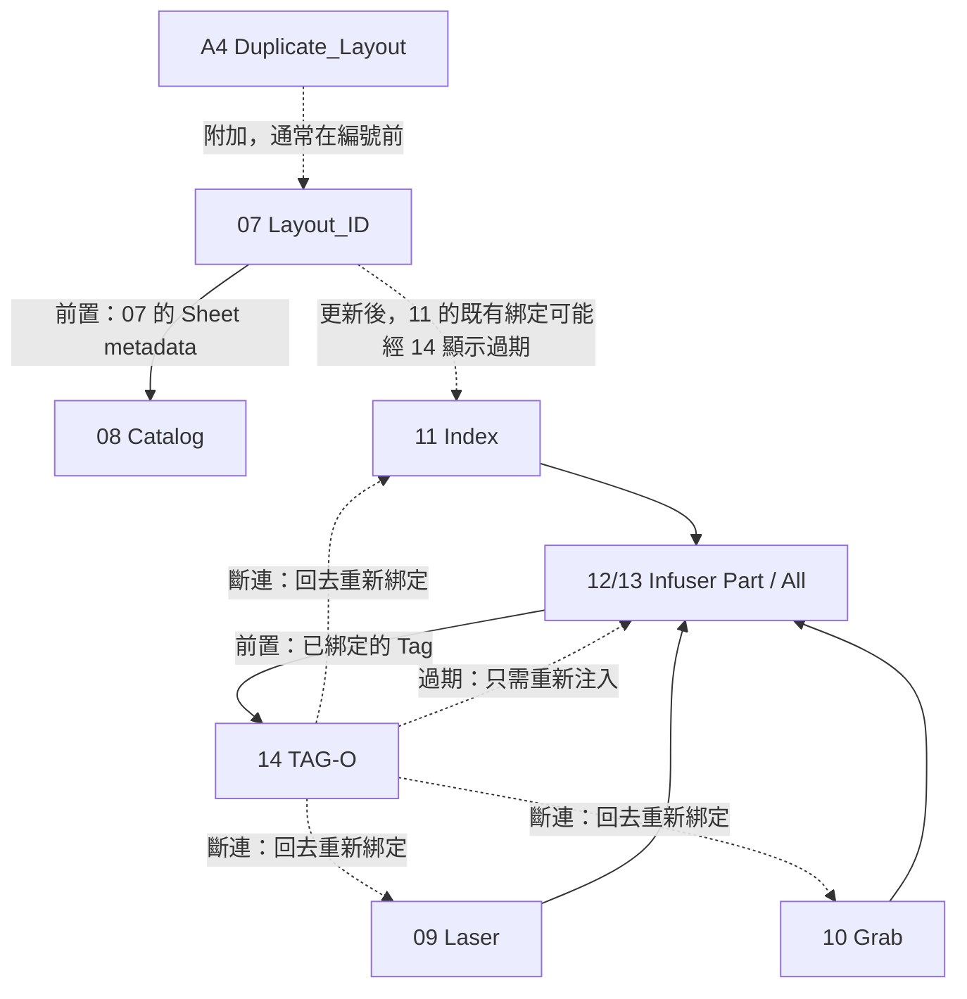

# LoopFlow 主工作鏈

數字（01–14）是主工作鏈，依序或分流走過；A 系列是不卡在鏈上、隨時可用或選用的附加工具。

> 這份是給人看的主工作鏈圖，**不是** 2.0 實作規格。規格以 `v2/docs/` 根目錄六份文件為準。
>
> 這份 Markdown 是給你手動調整用的。改完文字或流程後告訴我，我會照這份重新產生對應的 HTML（跟先前送出的那份同一套視覺）。
> 下面的 Mermaid 圖只表達「誰接誰」的結構；每個節點完整的說明文字在圖表下方的表格裡，要改敘述就改表格，要改流程走向就改 Mermaid。

---

## 01–06　字典到模型到剖面

字典準備是一段人工核對迴圈，不是三支平行工具：03 匯出字典比對用的檔案，02 開啟它，使用者對照後手動改回 01；只有 01（正式字典）會接到 04，02、03 本身不直接餵給 04。

| ID  | 指令                          | 說明                                                                                                  |
| --- | --------------------------- | --------------------------------------------------------------------------------------------------- |
| 03  | `LF_Export_Type_Layers`     | 依圖層匯出字典，供人工核對，產生的檔案由 02 開啟                                                                         |
| 02  | `LF_Open_Dictionary_Export` | 開啟從圖層匯出的字典，供人工核對後手動修改回 01                                                                          |
| 01  | `LF_Open_Dictionary`        | 開啟正式 Excel 字典；經 02／03 核對修改後的內容供 04 讀取                                                              |
| 04  | `LF_Nexus`                  | 將字典資料寫入模型；同一選單接著檢核，比對寫入結果與物件現值                                                                      |
| A2  | `LF_Data_Viewer`            | 點選物件唯讀顯示現有資料，不寫入、不卡在鏈上                                                                              |
| 05  | `LF_Publish_Exchange`       | 3D 與 2D 的交接檔，由模型資料寫入，發布新的 Registry revision（前置：04 的檢核通過）                                            |
| ＊   | `Rhino Section`（原生）         | Rhino 原生剖面工具，產出圖面 A，持續與 3D 模型同步                                                                     |
| 06  | `LF_Anchor_Frame`           | 依圖面 A 登記固定的 2D↔3D 對應，生成錨定外框，供 Laser 定位用                                                             |
| A3  | `LF_Extract_CP`             | 依圖面 A 擷取線稿到新圖層，產生可編輯的圖面 B。使用者可將圖面 B 連同錨定框一起沿 X 或 Y 方向平移，放置在圖面 A 旁邊：圖面 A 仍持續與 3D 模型同步，圖面 B 從此離線、不再連結 |

**分流前的補充**：06 完成後，後續 Laser 可對圖面 A 或已平移好的圖面 B 操作——兩者共用同一個錨定框；框本身可移動，隨使用中的那張圖一起平移。

---

## 07–14　分為兩條路徑

07 與路徑 B 有一條真實的跨路徑依賴：07 重新編號（例如插頁）後，原本由 11 綁定的 Index Tag 顯示內容會經 14 檢查判定為過期，不需要重新執行 11，只要重跑 12／13 重新注入即可更新。

### 路徑 A · 圖紙與圖目錄

| ID  | 指令                    | 說明                                                         |
| --- | --------------------- | ---------------------------------------------------------- |
| A4  | `LF_Duplicate_Layout` | 複製指定數量的 Layout，通常在編號前使用                                    |
| 07  | `LF_Tagger_Layout_ID` | 按規則自動命名 Layout 圖號，寫入圖框圖號與圖名，同時寫入文件 Sheet metadata          |
| 08  | `LF_Catalog`          | 只消費 Sheet metadata 建立圖目錄，不重新解析頁面（前置：07 寫入的 Sheet metadata） |

### 路徑 B · Tag 綁定與注入

三種綁定模式，擇一或並用：

| ID  | 指令                | 說明                             |
| --- | ----------------- | ------------------------------ |
| 09  | `LF_Tagger_Laser` | 點選處的投影區域射線綁定物件；須落在 06 已登記的錨定框內 |
| 10  | `LF_Tagger_Grab`  | 直接抓取實際剖面線的來源物件                 |
| 11  | `LF_Tagger_Index` | 綁定到指定的 Detail View             |

注入（前置：已綁定的 Tag；12／13 為同一動作的範圍擇一，不是兩個步驟）：

| ID  | 指令                | 說明     |
| --- | ----------------- | ------ |
| 12  | `LF_Infuser_Part` | 寫入目前頁面 |
| 13  | `LF_Infuser_All`  | 寫入所有頁面 |

### 彙整

| ID  | 指令         | 說明                                        |
| --- | ---------- | ----------------------------------------- |
| 14  | `LF_TAG-O` | 檢查所有頁面 Tag 的健康狀態：正常／過期／斷連（前置：12／13 已完成注入） |

**回饋迴圈**：↻ 14 標示過期 → 只需重跑 12–13 重新注入，不必重新綁定；標示斷連 → 先回 09–11 重新綁定，再重跑 12–13。14 只檢查與上色，不做自動修復。

---

## A1・A5　不卡在鏈上的獨立工具

| ID  | 指令                    | 說明                      |
| --- | --------------------- | ----------------------- |
| A1  | `LF_Sync_Worksession` | 雙機同步作業                  |
| A5  | `LF_Document`         | GitHub 上的 LoopFlow 使用說明 |
