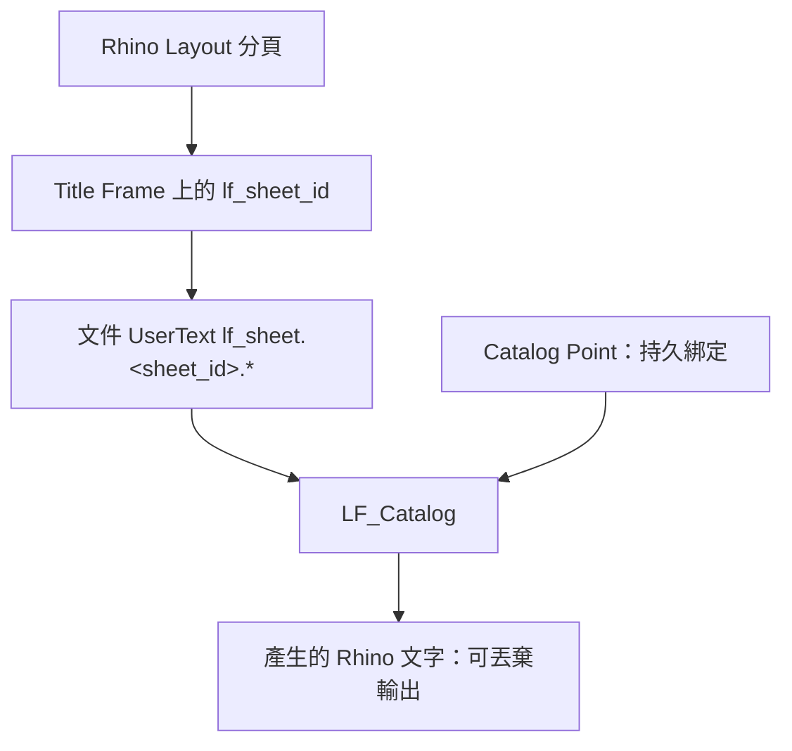

# LoopFlow 2.0 — LF_Catalog 圖目錄規劃

本文件是 **LF-E05 `LF_Catalog`** 的規劃來源，定位與 `Nexus拆分計畫.md` 相同：記錄決策與工作包，**不是**權威資料契約。正式的 canonical key、身分與寫入規則以 `資料契約.md` 為準；使用者操作順序以 `工作流程.md` 為準；即時進度只記錄於 `重構進度.md`。

本文件在 D04 開工前寫下，目的是先鎖定責任邊界與演算法，避免 Catalog 實作時自行補一套 Layout 解析。**D04 與 LF_Catalog 均已完成，並於家中 Rhino 8 實機通過（2026-08-18）。**

## 範圍與責任邊界

`LF_Catalog` 依使用者選定的 Sheet 自動建立 Rhino 圖目錄，一列一組「圖號　圖名」，由頁面左上往下排列，一欄填滿後接續右欄。

```text
D04           = Sheet metadata producer
LF_Catalog    = Sheet metadata consumer
```

| 由 D04 負責 | 由 LF_Catalog 負責 |
|---|---|
| `sheet_id` 的建立與維持 | 選取要列入目錄的 Sheet |
| active Sheet 判斷 | 選取圖號／圖名定位點 |
| `drawing_no`、`drawing_name` | 定位點的分頁與空間排序 |
| Sheet metadata 與頁序 | 定位點 ↔ `sheet_id` 綁定 |
| Layout 頁名 | 產生／重建文字、TXT 匯出、missing sheet 報告 |

兩者唯一的正式資料介面是 `sheet_id` 與 Sheet metadata API。LF_Catalog **不得**解析 Layout 頁名、不得從圖框文字讀圖號、不得從既有文字反推圖名、不得建立第二份 Layout registry，也不得保存 `drawing_no`／`drawing_name` 的副本。

## 核心資料關係



兩句核心契約：

- `sheet_id` 才是 Sheet 的身分。Catalog 定位點綁 `sheet_id`，**永不**綁目前的圖號。
- Catalog 文字是可丟棄的輸出，Catalog 定位點是持久的綁定。

因此重新編號、改圖名、文字被刪、文字被手改，都能由「定位點 + Sheet metadata」還原內容；字型、大小、圖層、顏色存在對應定位點上，缺件新建時套用。已移動的位置仍只在文字物件上，Refresh 不拉回定位點。

## 定位點契約

Catalog Anchor 是 Rhino Point 物件，UserText：

| key | 意義 |
|---|---|
| `lf_catalog_id` | 屬於哪一份圖目錄，UUID；同一文件可有多份目錄 |
| `lf_catalog_field` | 只允許 `drawing_no` 或 `drawing_name` |
| `lf_catalog_sheet_id` | 目前綁定的 Sheet；未使用的空位不寫此欄 |
| `lf_catalog_home_layer` | 選取歸位前的圖層；清除定位點時還原 |
| `lf_catalog_text_font` | 該格文字字型名；缺欄新建用 `Arial` |
| `lf_catalog_text_height` | 該格文字字高；缺欄新建用 `3.0` |
| `lf_catalog_text_layer` | 該格文字圖層；缺欄新建用 `LoopFlow::Drawing_Text` |
| `lf_catalog_text_color` | 該格文字顏色 `r,g,b` 或 `by_layer` |

`lf_catalog_id` 與 `lf_catalog_field` 代表定位點的模板角色，`lf_catalog_sheet_id` 只代表目前綁定，因此**空位仍是合法 anchor**：40 格的模板可以只放 28 張圖。定位點不保存圖號、圖名實值，也不保存 Layout 頁名。圖號格與圖名格各自記住文字外觀。

產生文字寫 `lf_generated_by = LF_Catalog`、`lf_catalog_id`、`lf_catalog_point_id`、`lf_catalog_field`。新建時定位點是文字左下角原點。Build／Rebind／Refresh 先把現有目錄文字的字型、大小、圖層、顏色寫回定位點；對得到定位點就只改內容，不重設外觀，也不把已移動的文字拉回定位點；對不到才新建並套用該點記下的外觀。未用到的舊目錄文字才刪。定位點寫 `lf_catalog_home_layer`。**不得**用「定位點附近的文字」來判斷哪些是目錄文字。

## 三條硬規則

### 1. 定位點必須是獨立物件

Block 內的 Point 屬於 block 幾何，無法個別換圖層、也無法個別寫 UserText。因此：

- Catalog Point 一律是文件中的獨立 Point 物件。
- 圖目錄模板若做成 Block，Block 內**只放格線與框線**，定位點另外獨立繪製。
- 選到 Block instance 或其子物件時**報錯並零寫入**，不得默默略過。

### 2. 圖層是 discovery，不是 identity

定位點選完後歸位到固定圖層（見下節）。圖層回答「去哪裡找定位點」，定位點上的 UserText 才是綁定本身。因此：

- 使用者把無關的 Point 拖進 `LoopFlow::Drawing_Number`，**不得**因為它在圖層上就當成 anchor。
- 判定條件是「在該圖層**且**具備 `lf_catalog_id`」兩者同時成立。
- 不得以「該圖層上的第 N 個 Point」推導第 N 列。

這與 ECO-02「Layer 是人類分類入口，不是永久資料 ID」一致。

### 3. 圖層名不是 canonical key

圖層叫 `Drawing_Number`，Sheet metadata 的欄位叫 `drawing_no`；圖層叫 `Drawing_Name`，欄位叫 `drawing_name`。兩者刻意不一致，**不得由圖層名反推 `lf_catalog_field` 的值**；`lf_catalog_field` 只能是 `drawing_no` 或 `drawing_name`。

## 定位點圖層歸位

選取圖號／圖名定位點之後，把選到的 Point 移到固定圖層並套固定顏色，沿用 `LF_Anchor_Frame` 的既有做法（`features/view/register.py` 的 `ensure_layer`／`set_layer_appearance`／`set_object_layer`，`features/view/keys.py` 的 `ANCHOR_LAYER`／`ANCHOR_COLOR`）。平台層不需新增方法，`objects_on_layer` 已存在。

| 動作 | 目標圖層 | 顏色 |
|---|---|---|
| 選取圖號定位點 | `LoopFlow::Drawing_Number` | 紅 `(255, 0, 0)` |
| 選取圖名定位點 | `LoopFlow::Drawing_Name` | 綠 `(0, 255, 0)` |
| 產生目錄文字 | `LoopFlow::Drawing_Text` | `#CDB38B` `(205, 179, 139)` |

紅綠區分讓「圖名定位點被誤拖到圖號欄」在畫面上一眼可辨，但這只是輔助，不取代程式檢查。

**歸位當下就會修改文件**，因此「選取定位點」是各自獨立的動作，不受後續 Build 取消影響；Build 的零寫入範圍不包含已完成的圖層歸位。此性質與 `LF_Anchor_Frame` 建立 Anchor 相同。`LoopFlow` 與其子圖層一律不列印（列印寬度 `No Print`）。

## 排序演算法：必須先分頁

圖目錄畫在 **Layout 分頁（紙空間）**，可能跨多頁。Rhino 每個 Layout 頁的座標各自從原點起算，所以第 1 頁與第 2 頁都會有 X≈100、Y≈200 的定位點；而 `objects_on_layer` 一次回傳整份文件所有頁的 Point。

若不分頁就做 X 分欄，跨頁定位點會被混進同一組交錯排序 —— **產生的順序是錯的，但畫面上每一格都有字，看不出異常**。分頁分組不是可選優化，是正確性的必要條件。

```text
所有 Catalog Point
→ 依所在 Layout 頁的頁序分組
→ 每頁內依 X 分欄（同欄容差內視為同一欄）
→ 各欄依 Y 遞減（由上往下）
→ 形成 anchor 序列
```

X 需要容差，因為同一欄的定位點 X 可能有 `102.001`／`101.998`／`102.004` 的微小誤差，直接排序會亂序。

## 配對驗證

圖號與圖名定位點各自排序後配對，並做兩層檢查：

1. **逐頁數量比對**。全域總數相等不算通過 —— 第 1 頁少一個、第 2 頁多一個時總數仍相等，但配對全錯。
2. **同列驗證**。圖名定位點必須落在對應圖號定位點的 Y 容差帶內；不在同列即報錯並零寫入。純按索引配對只驗數量的話，某個圖名定位點被誤拖到隔壁欄時數量仍相等，該欄以下全部錯位而沒有任何檢查抓得到。

Sheet 順序用 Rhino Layout 頁序（不用圖號字串排序），定位點對數可多於選定 Sheet 數，多餘的保持空白不建文字；Sheet 數多於可用對數則零寫入。

## 操作面板

Eto Panel，六個動作。沒有 Refresh、沒有「關閉」鈕（用視窗右上角 X 或 Esc）。生成／清除／匯出成功後關面板；上面三顆選取做完不關。

| 動作 | 行為 |
|---|---|
| 選取圖號定位點 | 選 Point → 歸位 `LoopFlow::Drawing_Number` → 面板顯示數量 |
| 選取圖名定位點 | 選 Point → 歸位 `LoopFlow::Drawing_Name` → 面板顯示數量 |
| 選取 Layout | 四欄對齊（頁序、圖號、圖名、頁名）；Shift 連選、Ctrl 加選或取消，點任一欄都算該列；選取列會反白 |
| 生成 圖號/圖名 | 驗證 → 預覽核對清單 → 寫定位點綁定 → 建立或更新文字；套用定位點記下的外觀 |
| 清除定位點並還原圖層 | 清除定位點目錄資料、還原選取前的圖層、刪除目錄文字 |
| 匯出 TXT | 依目前綁定輸出 `圖名, 圖號`，UTF-8 |

改圖名、插頁、刪圖、補圖都用「選取 Layout」再「生成 圖號/圖名」。面板不提供只改內容、不改綁定的 Refresh，以免誤刪格子文字且不能 Ctrl+Z。新增的 Layout **不自動**納入既有目錄（使用者可能刻意排除某些頁）。

面板固定顯示提醒：目錄定位點是持久控制物件，建立目錄後請勿刪除；移動目錄時請連同定位點一起移動。

## 更新與失效情境

| 情境 | 行為 |
|---|---|
| 圖名修改 | 「生成 圖號/圖名」後文字更新 |
| 插頁導致圖號改變 | `sheet_id` 不變；再生成可取到新 `drawing_no` |
| Layout 頁名被手改 | 完全不影響目錄 |
| 目錄文字被手改或移動 | 再生成把內容改回 metadata 值；字型／大小／圖層／顏色寫回定位點，位置留下 |
| 目錄文字被刪 | 定位點還在即可新建，並套用該點記下的外觀 |
| 定位點被移動 | 再生成不把已有文字拉回新點位 |
| 綁定的 Sheet 被刪除 | 再生成時該列不產出，報告 missing sheet；外觀已在定位點上 |
| 中間幾張圖刪除後再生成 | 該格若需重建文字，用該定位點記下的字型／大小／圖層／顏色，不是預設 |
| Sheet metadata 為 orphan | 同上；metadata 存在不等於 Sheet 仍 active |
| Sheet metadata 過期（頁序變了沒重跑 D04） | 回報 `stale` 並要求先執行 D04，不安靜輸出舊值 |

## 零寫入與逐項跳過

整體零寫入：文件 schema 無效、沒有選圖號或圖名定位點、逐頁數量不一致、同列驗證失敗、沒有選 Layout、Sheet 數超過可用對數、選到 Block 或其子物件、預覽取消、任一步 Esc。內部 `refresh_catalog`（面板已不提供）另加：找不到定位點、混入多個 `lf_catalog_id`、anchor 結構損壞。

逐項跳過並報告：綁定 Sheet 已刪除、orphan metadata、`drawing_no` 缺值、`drawing_name` 缺值。

## Duplicate Sheet 的連動

複製圖目錄頁很常見（做第二冊、留備份版本）。若不換號，兩份目錄會有相同的 `lf_catalog_id`，再生成會同時改到兩邊的文字，或 anchor 數量變兩倍而配對錯亂；而「混入**多個** `catalog_id` 才零寫入」的防呆剛好抓不到「同一個 `catalog_id` 出現兩次」。

因此 `資料契約.md` 的「Duplicate Sheet 特例」已增列：Catalog Point 的 `lf_catalog_id` 必須換新號，`lf_catalog_sheet_id` 依 Sheet 換號規則重新指定或清除。

## 建議結構與工作包

初版單一模組 `v2/src/loopflow/features/catalog/catalog.py`，功能長大再拆 `anchors.py`／`binding.py`／`export.py`。維持 D01–D04 的分層：純函式 + session／platform + runner + `run_guarded`。

純函式：`sort_catalog_points`（含分頁分組）、`pair_catalog_anchors`（逐頁數量與同列驗證）、`bind_sheets_to_anchors`、`build_catalog_rows`。Rhino 行為另包：`create_catalog_text`、`delete_generated_catalog_text`、`write_catalog_anchor_metadata`。Sheet 資料一律經 D04 的 Sheet metadata API，不自行組 `lf_sheet.<sheet_id>.*` 字串。

工作包順序：

1. Catalog contract 與 fixtures（含 `資料契約.md` 的 Catalog Anchor 正式章節）
2. 定位點排序純邏輯（分頁分組、X 分欄容差、Y 遞減）
3. 配對與綁定（逐頁數量、同列容差、Build／Rebind）
4. 產生文字與 Refresh（以 `lf_catalog_point_id` 就地更新，缺件才新建）
5. TXT 匯出
6. Eto Panel
7. Rhino 8 實機驗收

## 自動測試涵蓋

排序：單欄由上而下、雙欄左欄接右欄、X 微小誤差仍同欄、選取順序不影響結果、**跨頁不混排**。配對：逐頁數量相等／不等、同列驗證通過／失敗、Sheet 少於定位點、Sheet 多於定位點零寫入。綁定：生成寫入正確 `sheet_id`、再生成替換舊綁定。資料更新：改圖名、改圖號、改頁名不影響目錄、stale 偵測。缺失：Sheet 被刪、orphan metadata、欄位缺值。輸出：文字被刪可重建並套用定位點外觀、文字被手改可恢復內容、再生成維持字型／大小／圖層／位置、中間格重建不回預設、不影響人工文字。安全：Esc 零寫入、預覽取消零寫入、混入多個 `catalog_id` 零寫入、選到 Block 零寫入。匯出：順序與目錄一致、UTF-8 中文正常、Rhino 檔未儲存時要求選路徑。

## Rhino 8 實機驗收清單

1. 在圖目錄模板放兩欄定位點，選圖號、選圖名，確認歸位到紅／綠圖層
2. 選 10 張 Layout → 生成 圖號/圖名，驗證由左上往下、再往右欄排列
3. 檢查定位點 UserText（`lf_catalog_id`／`lf_catalog_field`／`lf_catalog_sheet_id`）
4. 改一張圖的圖名、並改過目錄文字的字型／大小 → 再生成，驗證內容更新且設定留下
5. 插入 Layout 並跑 D04 重新編號 → 再生成，驗證圖號更新
6. **不跑 D04 就生成**，驗證回報 stale 而不是輸出舊值
7. 刪一個目錄文字 → 再生成，驗證重建
8. 移動目錄文字 → 再生成，驗證位置留下且內容更新
9. 刪一張 Layout → 再生成，驗證 missing 報告且其餘正常
10. 目錄跨兩頁時驗證兩頁各自排序正確、不交錯
11. 故意把一個圖名定位點拖到隔壁欄，驗證報錯零寫入
12. 匯出 TXT，驗證內容與畫面目錄一致
13. Esc／取消各階段，驗證零寫入
14. 開面板後確認 `LoopFlow` 與子圖層列印寬度為 `No Print`
15. 面板沒有 Refresh、沒有「關閉」；生成／清除／匯出成功後關面板
16. 「清除定位點並還原圖層」確認後，點回到選取前的圖層、目錄文字刪除
17. 改字型／大小／圖層／顏色後刪中間幾張圖，Layout ID 再生成，該格重建文字應是改過的外觀

家中 Rhino 8（2026-08-18）已測：定位點歸位、Sheet 四欄與 Ctrl 加選、Build、Refresh 不拉回已移動文字、關閉鈕高度、列印寬度 `No Print`。2026-08-22 起面板改為六顆鈕、無 Refresh／關閉。上表其餘項目可作回歸。此檔是 Catalog 當時的操作指示；Infuser／TAG-O 其後已實機通過。不要開 G01。
