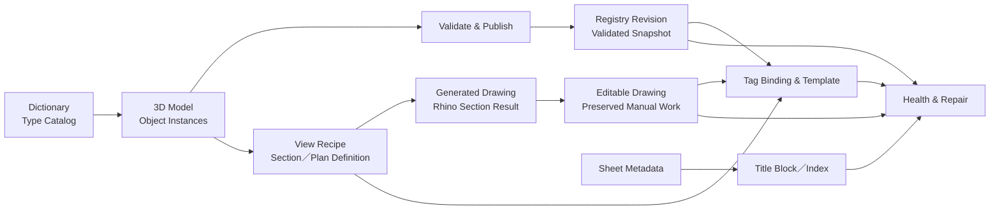

# LoopFlow 2.0 — 資料生態與工作鏈藍圖

本文件是 LoopFlow 2.0 的總體起點。它先從 1.x 全部 23 支 Python 還原現有功能與使用意圖，再提出可翻案、可反覆修訂的新資料生態。確立前仍是提案；確立後，Dictionary、Nexus、Section、Tag、圖框、Registry、任務拆分與使用指南都必須服從本文件。

## 文件狀態

- 建立日期：2026-08-12
- 盤點基準：`releases/LoopFlow/Python/` 全部 23 支 Python，共 5,800 行
- 程式基準最後異動：`087ed73`；本次只讀取與建檔，未修改產品程式碼
- 工作檔基準：Dropbox 中文版 `LoopFlow_Dictionary.xlsx`
- 驗證層級：靜態閱讀與資料依賴盤點；尚未完成 Rhino 8 實機行為驗證
- 定位：工作邏輯必須維持，程式邊界、指令名稱、資料結構與建構方式都可以重新設計

## 不可遺失的工作邏輯

LoopFlow 的核心不是某支程式，而是以下可以反覆執行、逐步確認的工作鏈：

1. 建立與修改 3D 模型。
2. 依 Dictionary、空間、尺寸、高程與個別設定，把可追蹤資料注入模型物件。
3. 透過 Rhino 內建 Section／Clipping Drawing 能力建立剖面、立面與各種平面。
4. 將 Section 成果轉成可以獨立編輯的圖面；後續人工調整不得被無聲覆蓋。
5. 在 Layout 建立圖框與各種 Tag Block；Tag 能從對應的模型來源取得資料。
6. 讓圖號、圖名、剖面索引、Tag 顯示值和模型資料使用同一條資料鏈。
7. 模型、圖面、Layout 或 Tag 改變後，能辨認哪些資料仍有效、哪些已過期或斷線。
8. 提供可理解、可選擇且不破壞人工成果的修復方式，把變更安全延續到最末端。

保留「使用者決定何時前進到下一階段」的半自動精神。系統可以提供批次處理與建議，但不能在未確認的情況下自動改完整專案。

## 一句話架構

> Dictionary 定義類型，3D 模型保存實例，Registry 發布已驗證快照，View 定義出圖方式，Drawing 保存可編輯成果，Sheet 管理圖面身分，Tag 消費資料，Health Engine 追蹤並修復整條生命週期。

## 建議的總體資料流



箭頭表示來源或依賴，不代表所有資料都複製到下一層。每一層只保存自己負責的真相，以及回到來源所需的 ID 與 revision。

## 資料實體與真相邊界

| 實體 | 建議穩定 ID | 唯一真相 | 不應承擔 |
|---|---|---|---|
| Project | `project_id` | 同一套模型、圖面、Dictionary 與 Registry 的專案範圍 | 依資料夾名稱猜身分 |
| Type | `type_id` | Dictionary 的物件類型、預設值、欄位規則與允許 Tag | 保存每個物件的即時數值 |
| Rhino Layer | 不作永久資料 ID | 人類分類、選取、顯示與建模入口 | 成為 Tag／Registry 的唯一關聯鍵 |
| Model Object | `object_id` | 3D 幾何與單一實例的實際資料／覆寫值 | 保存圖框名稱或 Layout 順序 |
| Space | `space_id` | 空間邊界、顯示名稱、樓層與判定規則 | 只靠可變的空間名稱作關聯 |
| View Recipe | `view_id` | Section／平面的位置、方向、轉換、比例與來源範圍 | 保存完整物件資料 |
| Drawing | `drawing_id` | 某次 View 生成後的 2D 成果與人工編修狀態 | 靜默回寫 3D 或假裝永遠最新 |
| Sheet | `sheet_id` | 圖種、樓層、區域、系列、序號、圖名、版次與狀態 | 從 Layout 名稱反向猜全部 metadata |
| Tag | `tag_id` | Tag 類型、來源綁定、顯示模板、人工鎖定與同步狀態 | 複製保存整份模型資料 |
| Registry Revision | `revision` | 某次成功發布的不可變、已驗證資料快照 | 取代 3D 模型成為人工編輯來源 |
| Health Issue | `issue_id` | 斷線、過期、衝突、原因、建議修復與處理結果 | 只靠物件顏色表示狀態 |

### Layer 與 Type 分離

使用者仍可使用目前容易閱讀的中英雙語 layer：

```text
02_Wall_牆面::Tiles.磁磚
```

但程式關聯使用不隨顯示名稱改變的 Type ID，例如：

```text
type_id = wall.finish.tile
layer_path = 02_Wall_牆面::Tiles.磁磚
display_name_zh = 磁磚牆面
```

Layer path 可以調整或重新分類；Type ID、Object ID 與既有 Tag 關聯不應因此失效。

### Type 資料與 Instance 資料分離

Dictionary 提供類型預設；模型物件保存實例真相。有效值採一致的解析順序：

```text
物件明確覆寫值
→ Dictionary 類型預設值
→ schema 系統預設值
→ 缺值／錯誤
```

使用者必須能看到值的來源，並能執行「恢復 Dictionary 預設」，而不是靠手動刪除 UserText 猜測結果。

## 標準工作鏈

| 階段 | 使用者意圖 | 主要輸入 | 主要產出 | 前進條件 |
|---|---|---|---|---|
| W1 定義 | 建立可用的分類與資料規則 | Dictionary、schema、layer taxonomy | Type Catalog、模型 layer | Dictionary 驗證通過 |
| W2 建模 | 建立與調整設計 | Rhino layer、幾何、Block | 3D Model Objects | 物件可被分類 |
| W3 資料化 | 注入與覆寫實例資料 | Type defaults、幾何、Space、Elevation | 帶穩定 ID 的 Model Objects | 必填資料與 ID 通過驗證 |
| W4 發布 | 提供跨文件可讀資料 | 已驗證 Model Objects | Registry Revision | pending 完整驗證並發布成功 |
| W5 建立 View | 定義剖面、立面、平面 | 模型、Section plane、顯示範圍 | View Recipe、Rhino Section 結果 | View 有穩定 ID 與轉換資訊 |
| W6 圖面化 | 取得可獨立編輯的線稿 | Section 結果 | Editable Drawing | 人工成果與來源關係已記錄 |
| W7 建立 Sheet | 安排 Layout 與圖框 | Drawing、Sheet metadata | Layout、Detail、圖框、圖號 | Sheet metadata 完整 |
| W8 建立 Tag | 由圖面位置綁定模型來源 | Drawing/View、Registry、Tag Template | 綁定完成的 Tag | 來源唯一或經使用者選定 |
| W9 同步 | 把最新資料延續到圖框與 Tag | Registry Revision、Sheet metadata | 更新的 Tag／圖框顯示 | 不覆寫人工鎖定內容 |
| W10 健康檢查 | 找出並修復資料鏈問題 | 全部 ID、revision 與狀態 | Issue Report、Repair Result | 修復可追蹤且可復原 |

每個階段都必須可以單獨重跑，並清楚回報成功、略過、警告、失敗與取消；不可把所有階段綁成一次不可中斷的大操作。

## Section 與可編輯圖面的建構原則

Section 中段應拆成三個概念，而不是複製後就失去來源：

1. **View Recipe**：剖面位置、視線方向、範圍、比例、座標轉換、來源文件與 `view_id`。
2. **Generated Result**：Rhino Section／Clipping Drawing 生成的原始成果，可重建。
3. **Editable Drawing**：供使用者編修的圖面成果，保存 `view_id`、生成 revision 與人工狀態。

建議的 Drawing 狀態：

| 狀態 | 意義 | 自動處理界線 |
|---|---|---|
| `generated` | 剛由來源建立，尚未辨識到人工修改 | 可以在明確更新命令中重建 |
| `modified` | 使用者已修改 | 不得靜默取代；先顯示差異或另建版本 |
| `detached` | 使用者刻意永久脫離自動更新 | 保留來源紀錄，但不主動重建 |
| `stale` | 來源模型或 View revision 已更新 | 提醒並提供更新選項 |
| `orphaned` | 來源 View／模型已不存在 | 保留人工圖面並列入修復清單 |
| `suppressed` | 使用者刻意不希望某項成果再次生成 | 更新時尊重此狀態 |

2.0 第一階段不必承諾自動合併線稿。健康的最低標準是：能辨認來源 revision、能保護人工編修、能報告 stale，並讓使用者選擇保留、重建、另建或脫離。

## Tag 的來源與模板

Tag 同時需要兩種上下文：

- **資料來源**：`source_object_id`，決定材料、名稱、高程等顯示資料。
- **圖面來源**：`view_id`／`drawing_id`／`sheet_id`，決定 Tag 位於哪張圖以及如何定位。

建議 Tag metadata：

```text
tag_id
tag_type
source_object_id
view_id
drawing_id
sheet_id
template_version
last_synced_revision
lock_state
manual_overrides
health_state
```

現行 Grab 與 Laser 代表兩個不同且都應保留的使用意圖：

- Grab：使用者直接選擇明確來源。
- Laser：使用者在 Section 圖面點位置，系統由 View 轉換回 3D 搜尋候選來源；多候選時由使用者選定。

綁定完成後，顯示資料從 Registry 依 Object ID 取得。圖面幾何協助定位，但不應成為資料真相。

Tag Template 應宣告「需要哪些欄位、如何顯示、缺值如何處理」，而不是每新增一種 Tag 就再複製一套 Infuser 判斷。例如：

```text
TAG_HEIGHT
  source: model_object
  fields:
    attr_ch_key  <- elevation.basis
    attr_ch_val  <- elevation.display
    attr_mat_key <- type.code
    attr_mat_val <- type.display_name
    attr_note    <- object.note
```

## Sheet、圖框與索引

圖框與自動命名使用 Sheet metadata 作為真相；Layout 名稱只是輸出結果。

建議欄位：

```text
sheet_id
discipline
drawing_type
level
zone
series
sequence
title
revision
status
```

命名規則根據 metadata 輸出：

```text
IN 101.01__一樓平面配置圖
```

而不是從這個字串反向猜出 discipline、series 與 sequence。如此未來改命名格式、插頁、調整順序或建立多套交付格式時，不必破壞圖框與 Section Index Tag。

## Registry 與 revision 傳遞

Registry 是唯讀發布快照，不是人工資料庫。每次成功發布至少包含：

```text
schema_version
project_id
document_id
revision
published_at
producer_version
types
objects
spaces
views
sheets
```

Dropbox `exchange/` 的建議發布模型：

```text
registry.pending.json
→ validate
→ registry.current.json
→ 保留 registry.previous.json
```

每個下游成果保存自己最後使用的 `revision`：

```text
Model revision
→ Registry published revision
→ Drawing source revision
→ Tag last synced revision
```

因此系統可以精確說明「來源已更新，但這張圖／這個 Tag 尚未同步」，而不是只顯示模糊紅色。

## Health 與 Repair

| 狀態 | 意義 | 建議處理 |
|---|---|---|
| `healthy` | 來源存在、schema 相容且使用最新 revision | 不處理 |
| `stale_data` | Registry 有新 revision，顯示尚未更新 | 重新同步顯示值 |
| `unbound` | 尚未指定來源 | Grab、Laser 或其他綁定方式 |
| `orphaned` | 原來源已刪除或移出專案 | 選新來源、刻意脫離或保留問題 |
| `ambiguous` | 定位得到多個候選來源 | 顯示候選並由使用者確認 |
| `view_missing` | View／Detail／Section 不存在 | 重新連結或保留為 detached |
| `drawing_stale` | 3D／View 已更新，Editable Drawing 尚未更新 | 比對後保留、重建或另建 |
| `template_outdated` | Tag Block definition／template 版本落後 | 保留位置與綁定後升級模板 |
| `manual_locked` | 使用者禁止自動更新 | 尊重鎖定並列入報告 |
| `schema_mismatch` | 來源版本不相容 | 停止寫入，要求 migration 或正確版本 |

Health Engine 必須從正式 metadata 判斷。顏色只作視覺提示，清除提示時不得破壞使用者原本顏色。

## 23 支現行 Python：功能、意圖與 2.0 去向

### Foundation 與共用規則

| 現行檔案 | 現行功能 | 必須保留的意圖 | 2.0 建議責任 |
|---|---|---|---|
| `_LoopFlow_Config.py` | 集中 Dictionary、layer、顏色、Block、Layout、lock 等常數 | 專案有可理解且可調的設定 | 拆成 schema／catalog／真正的 user settings；內部契約不可假裝成自由設定 |
| `_LF_Debug.py` | 將 exception、traceback、時間與 context 寫入 log | 錯誤可追蹤且不只顯示「失敗」 | Foundation logging；每個 operation 使用一致 stage／result |
| `_LF_Registry.py` | 建立 Registry、lock、讀寫 Objects／Layout_Map／Tag_Links | 跨 3D／2D 文件共享最後有效資料 | Registry Publisher／Reader；加入 schema、真正 exclusive lock、pending、validate、atomic replace |
| `_LF_NamingRules.py` | 從 JSON 或預設規則解析 Layout 名稱、產生 DWG_NO／REF_ID | 圖號格式可配置且能批次一致更新 | Sheet Naming Service；輸入 Sheet metadata，不再以 Layout 字串作主要資料來源 |

### Dictionary、模型與發布

| 現行檔案 | 現行功能 | 必須保留的意圖 | 2.0 建議責任 |
|---|---|---|---|
| `LF_Nexus.py` | Dict to Layer、TagTrigger、TagChecker、Layer to Dict、Boundary Setter、尺寸／高程／空間／UUID、Push 入口與 UI | 提供一個可查看、執行、檢查核心資料工作的入口 | 保留 Nexus 名稱作 Project Console；實際工作交給 Type、Model Data、Space、Elevation、Dimension、Validation、Publish services |
| `LF_Dictionary_Editor.py` | 找到並開啟 XLSX | 使用者能直接維護 Dictionary | Dictionary command；改由 `LOOPFLOW_WORKFILES_ROOT` resolver 開啟指定中文版本 |
| `LF_Data_Viewer.py` | 唯讀顯示選取物件的全部 UserText | 隨時檢查物件或 Tag 實際資料 | Inspector；顯示 canonical 值、來源、revision、override 與 health，不只列 raw UserText |
| `LF_Push_3D_to_JSON.py` | 掃描 M3D solids，依 UUID 將全部 UserText、layer、時間推入 Registry | 明確發布 3D 資料供其他文件使用 | Model Publisher；只發布版本化 schema 欄位與 extension，不把所有 UserText 無條件變成永久 API |
| `LF_Sync_Worksession.py` | 監看同資料夾 `.3dm` 變動，Rhino idle 時 refresh Worksession | 3D 與圖面文件能安全看到最新引用 | Collaboration／Refresh Service；監看明確來源與事件，debounce、生命週期與錯誤狀態可見 |

### Section、Layout 與可編輯圖面

| 現行檔案 | 現行功能 | 必須保留的意圖 | 2.0 建議責任 |
|---|---|---|---|
| `LF_Anchor_Frame.py` | 由 Section 幾何與 Text Dot 建 bbox frame，寫 `Target_CP`／`Role`，供 Laser 做 2D→3D 對位 | Section 圖面位置能映射回 3D View | View Registration；以 `view_id` 與正式座標轉換取代名稱包含比對與 bbox 猜測 |
| `LF_Extract_CP.py` | 複製 Visible／Hatch／Curve 到 Extract layer，改 ByLayer，形成可獨立編輯副本 | Section 成果可脫離即時顯示並人工修改 | Drawing Materializer；建立 `drawing_id`、來源 revision、狀態與保護人工編修的更新流程 |
| `LF_Duplicate_Layout.py` | 複製 Layout 尺寸、Detail、圖框、Tag 等物件並產 `_Copy_N` 名稱 | 能快速從標準版面建立新 Sheet | Sheet Duplicator／Template；複製時建立新 `sheet_id`／`tag_id`，保留模板但不複製錯誤身分 |

### Tag、資料注入與健康檢查

| 現行檔案 | 現行功能 | 必須保留的意圖 | 2.0 建議責任 |
|---|---|---|---|
| `LF_Tagger_Grab.py` | 在 Layout Detail 內直接選目標；一般物件綁 UUID，DW／Item 從 Block 名稱解析 shadow fields | 使用者可以直接指定確定來源 | Direct Binding command；所有來源都轉成明確 ID，名稱解析只作 migration／輔助，不用 `NAME_PARSED` 假來源 |
| `LF_Tagger_Laser.py` | 由 Detail 點位、Anchor／CP 轉回 3D 射線，依正面與距離選物件；重疊時人工選擇 | 從 Section 圖面位置快速找到 3D 資料來源 | Spatial Binding command；使用正式 View transform、候選與 ambiguous 狀態，綁定後保存 Object ID |
| `LF_Tagger_Index.py` | 將 Section／Elevation Index Tag 綁到某個 Detail View GUID | 剖面索引能跟隨目標圖面改名或換頁 | Sheet／View Reference Binding；保存目標 `view_id`／`sheet_id`，顯示值由 Sheet metadata 產生 |
| `LF_Tagger_Layout_ID.py` | 依 Layout 順序與 `.01` baseline 自動命名，寫圖框 DWG_NO／DWG_NAME，發布 Layout_Map | 全案圖號、圖名、圖框與索引一致 | Sheet Catalog／Naming command；metadata-first，排序與命名只是可重算輸出 |
| `LF_Infuser_Part.py` | 更新目前 Layout Tag；依 Source_UUID／Detail 找資料，處理 lock、未綁定、斷線與顏色 | 局部、安全、可反覆把最新資料注入 Tag | Tag Renderer／Synchronizer；依 template mapping 更新，保存 revision，回傳正式 health，不以顏色作真相 |
| `LF_Infuser_All.py` | 對全部 Layout 呼叫 Part，統計成功／未綁定／斷線／鎖定 | 一次檢查與同步整份圖說 | Batch Tag Synchronizer；和 Part 使用同一 service，只改 scope |
| `LF_TAG-O.py` | 讀警示顏色找 unbound／broken Tag，檢查每個 Space 是否有 Finish Tag | 在交付前確認 Tag 存活與空間覆蓋 | Health Dashboard／Repair Center；以 metadata／revision 判斷，提供導航、修復與可追蹤結果 |

### Cabinet 與 2D 輔助生產

| 現行檔案 | 現行功能 | 必須保留的意圖 | 2.0 建議責任 |
|---|---|---|---|
| `LF_Cabinet_Suite.py` | 產生櫃體板件／門片、Shelf／Divider，寫 `_CB.*`，依幾何猜板件與更新 BOM 尺寸 | 快速建立可攜帶製作資料的櫃體模型 | Cabinet feature；與核心共用 Object／Type schema，板件 local frame 與 BOM contract 先定義，UI／幾何可延後重建 |
| `LF_2D_Cabinet_Gen.py` | 由選取矩形與櫃體類型產生群組化 2D 櫃體符號 | 快速補充可人工編輯的標準 2D 圖例 | Drawing Tool；輸出有 tool/version metadata，但不必成為核心資料真相 |
| `LF_2D_Shelf_Gap.py` | 依矩形、方向、板厚與目標間距計算分隔並畫層板線 | 快速建立規則化 2D 細節 | Drawing Tool；保留獨立小工具，使用共用單位／結果／復原規則 |
| `LF_2D_DW_Gen.py` | 以開口兩點、方向與門窗類型產生框、扇、軌道、開啟弧與輔助線 | 快速建立標準門窗 2D 符號 | Drawing Tool／Template Generator；幾何規則獨立，不承擔門窗資料身分 |

## 現行機制：保留意圖、翻案做法

| 應保留 | 應翻案 |
|---|---|
| Dictionary 是建模與資料化入口 | 用完整 layer path 或欄名字尾作永久身分 |
| Nexus 提供核心工作總覽與明確手動步驟 | Nexus 單檔同時做 UI、幾何、Excel、資料規則與發布 |
| Rhino Section 是剖面／平面的主要生成能力 | 複製後完全失去來源、無法判斷 stale |
| Extract 後圖面可以獨立編輯 | 更新時無法區分自動成果與人工修改 |
| Grab、Laser 與 Index 三種綁定意圖 | `NAME_PARSED`、名稱包含、bbox 與顏色被當成正式關聯 |
| Part／All 兩種同步範圍 | 每種 Tag 在 Python 中硬寫一套欄位 mapping |
| 圖號規則可以設定、全案一致 | 從 Layout 名稱與順序反推 Sheet 資料 |
| TAG-O 在交付前檢查存活與覆蓋 | 先跑 Infuser 塗色，再以物件顏色判斷真實狀態 |
| Cabinet／2D 工具可延後但持續存在 | 讓它們自行發明欄位、單位與錯誤處理 |
| 使用者控制更新時機與人工例外 | 一鍵流程靜默重綁、覆寫或刪除成果 |

## 擴充模型

若資料生態成立，未來擴充應主要增加定義或 adapter，而不是修改整條鏈：

| 擴充需求 | 理想做法 |
|---|---|
| 新增模型類型 | 增加 Type Catalog row／definition 與必要 validator |
| 新增資料欄位 | 加 schema field、單一 producer、consumer mapping 與 fixture |
| 新增 Tag | 加 Tag Template 與 Block asset；沿用 Binding／Renderer／Health |
| 新增 Section／平面類型 | 加 View Recipe adapter；沿用 Drawing lifecycle |
| 新增圖號格式 | 加 Naming Rule；不改 Sheet metadata |
| 新增輸出格式或外部工具 | 消費版本化 Registry，不直接掃描任意 UserText |
| 新增健康規則 | 加 rule 與 repair action；不利用新顏色假裝資料欄位 |
| 升級舊專案 | Migration scanner／preview／backup／converter；新核心不長期雙寫 |

## 文件應讓新使用者如何上手

最終使用文件不依程式檔名組織，而依工作流程分層：

1. **五分鐘開始**：從一個 3D 物件到第一個正確 Tag。
2. **核心概念**：Type、Object、Space、View、Drawing、Sheet、Tag。
3. **標準工作流程**：每一步的前置、輸入、輸出與下一步。
4. **Section 與可編輯圖面**：建立、脫離、修改、過期與更新。
5. **Tag 與圖框**：綁定、模板、命名、同步。
6. **健康與修復**：每個狀態代表什麼、如何安全處理。
7. **Dictionary 管理**：人類欄名、Type、預設值與驗證。
8. **進階設定與擴充**：新增 Type、Tag、命名規則與 adapter。
9. **開發者契約**：schema、ID、revision、Registry 與 migration。

每個使用者指令只需回答：用途、在哪裡執行、執行前需要什麼、會修改什麼、成功後得到什麼、下一步是什麼。

## 建議先確認的生態原則

以下是後續細項決策的上位原則，目前先作建議基線：

| ID | 原則 | 建議 |
|---|---|---|
| ECO-01 | Dictionary 是 Type Catalog；3D Object 是 Instance truth | 採用 |
| ECO-02 | Layer 是人類分類入口，不是永久資料 ID | 採用 |
| ECO-03 | Section 圖面可獨立編輯；任何更新不得靜默覆寫人工成果 | 採用 |
| ECO-04 | Tag 綁定穩定 Object／View／Sheet ID；圖面位置只協助定位 | 採用 |
| ECO-05 | Sheet metadata 是圖框與命名真相；Layout 名稱是輸出 | 採用 |
| ECO-06 | Registry 是版本化唯讀發布快照，不是另一份人工資料庫 | 採用 |
| ECO-07 | 狀態、revision 與問題是正式資料；顏色只作提示 | 採用 |
| ECO-08 | 每階段可單獨執行、驗證、重跑與復原 | 採用 |

這些原則確立後，再把 `NEXUS_DICTIONARY_DECISION_MENU.md` 的 ND-01～ND-25 依本工作鏈重排；接著裁決 Space、Elevation、Dimension、Tag Template、Sheet naming、Drawing lifecycle 與 Registry schema 的細節。

## 本文件的確立門檻

- 使用者確認工作鏈沒有遺失實際作業目的。
- 23 支現行程式的「保留意圖」與「可翻案做法」分類合理。
- Type／Object／View／Drawing／Sheet／Tag／Registry 的真相邊界清楚。
- Section 人工編修的保護方式與 stale 行為完成裁決。
- Tag、圖框、索引、健康檢查都能沿 ID 與 revision 追溯來源。
- 後續新增 Type、Tag、View 或命名規則不需改寫整條工作鏈。

確立前可以多次修改本文件。確立後若要改上位原則，需同時檢查所有下游契約與 migration 影響，不在單一 feature 中偷偷改變。
