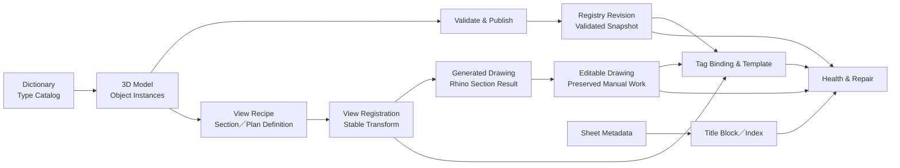

# LoopFlow 2.0 — 資料生態與工作鏈整合藍圖

本文件是 LoopFlow 2.0 的總體起點。它整合第一版資料生態藍圖與 Claude Code 的獨立複核，從 1.x 全部 23 支 Python 還原現有功能、實際資料流與使用意圖，再提出可翻案、可反覆修訂的新資料生態。工作邏輯必須維持，現行分檔、命名、資料結構與建構方式都可以重新設計。

## 文件狀態

- 建立日期：2026-08-12
- 盤點基準：`releases/LoopFlow/Python/` 全部 23 支 Python；Dropbox 中文版 Dictionary 共 18 欄、92 筆 Type
- 程式基準最後異動：`087ed73`；本次只讀取與建檔，未修改產品程式碼
- 工作檔基準：Dropbox 中文版 `LoopFlow_Dictionary.xlsx`
- 驗證層級：兩次獨立靜態讀碼、producer／consumer 搜尋與 Dictionary 統計；另以 Rhino 內實際 Block instance 擷取 9 份 Tag、1 份圖框共 24 個唯一 UserText key，並用 `Tag_Blocks.3dm` 畫面核對整體配置。尚未完成指令端到端實機、舊專案資料抽樣與精確 Block 樣式 manifest 驗證
- 操作證據：`wip/docs/loopflow_1.0_workflow_YT.txt` 是 1.0 逐步操作說明，屬**操作邏輯參考**，證明使用者實際怎麼用、在哪裡介入；它不是 2.0 的流程契約，也不等於 Rhino 行為已實機驗證
- 定位：工作邏輯的**意圖**必須維持——使用者何時寫資料、何時發布、綁定與同步範圍由誰決定；步驟順序、程式邊界、指令名稱、資料結構與建構方式都可以依新架構重新設計

兩份未合併的來源原文保存在：

- `ref/LOOPFLOW_DATA_ECOSYSTEM.md`
- `ref/LOOPFLOW_DATA_ECOSYSTEM_REVIEW_Claude_Code.md`

同目錄的相關文件：

| 文件 | 負責 |
|---|---|
| `LOOPFLOW_DATA_ECOSYSTEM_DECISIONS.md` | 待使用者裁決的 `ECO-*`／`ED-*` 項目與 AI 建議強度；裁決結果的唯一來源 |
| `LOOPFLOW_WORKFLOW_SIMULATION_v2.md` | 依 1.0 操作說明、現行 Python 與 10 份 Block 參數重新檢核的現行流程草案 |
| `LOOPFLOW_WORKFLOW_SIMULATION_v2.html` | 同內容的深色好讀版；由 v2 Markdown 產生，不手動編輯 |
| `LOOPFLOW_WORKFLOW_SIMULATION.md`／`.html` | 2026-08-12 初版提案，已標示由 v2 取代，只供差異追溯 |

本文的「現況事實」可由現行程式或 Dictionary 交叉確認，但不等於 2.0 必須沿用；由靜態讀碼推論的 Rhino 行為仍須實機測試。所有尚待使用者確認的原則與實務問題集中在 `LOOPFLOW_DATA_ECOSYSTEM_DECISIONS.md`，不在本文件維護第二份答案。

## 不可遺失的工作邏輯

LoopFlow 的核心不是某支程式，而是以下可以反覆執行、逐步確認的工作鏈：

1. 建立與修改 3D 模型。
2. 依 Dictionary、空間、尺寸、高程與個別設定，把可追蹤資料注入模型物件。
3. 透過 Rhino 內建 Section／Clipping Drawing 能力建立剖面、立面與各種平面。
4. 將 Section 成果轉成可以獨立編輯的圖面；後續人工調整不得被無聲覆蓋。
5. 在 Layout 建立圖框與各種 Tag Block；Tag 能從對應的模型來源取得資料。
6. 讓圖號、圖名、剖面索引、Tag 顯示值和模型資料使用同一條資料鏈。
7. 模型、圖面、Layout 或 Tag 改變後，能辨認哪些資料仍有效、哪些已過期或斷線。
8. 提供可理解、可選擇且不破壞人工成果的修復方式，把變更安全延續到最末端。

保留「使用者決定何時前進到下一階段」的半自動精神。系統可以提供批次處理與建議，但不能在未確認的情況下自動改完整專案。

## 一句話架構

> Dictionary 定義類型，3D 模型保存實例，Registry 發布已驗證快照，View 定義出圖方式，Drawing 保存可編輯成果，Sheet 管理圖面身分，Tag 消費資料，Health Engine 追蹤並修復整條生命週期。

## 建議的總體資料流



箭頭表示來源或依賴，不代表所有資料都複製到下一層。每一層只保存自己負責的真相，以及回到來源所需的 ID 與 revision。

## 資料實體與真相邊界

| 實體 | 建議穩定 ID | 唯一真相 | 不應承擔 |
|---|---|---|---|
| Project | `project_id` | 同一套模型、圖面、Dictionary、Registry 與工作檔根目錄 | 依目前開啟檔案或資料夾名稱猜身分 |
| Type | `type_id` | Dictionary 的物件類型、預設值、欄位規則與允許 Tag | 保存每個物件的即時數值 |
| Rhino Layer | 不作永久資料 ID | 人類分類、選取、顯示與建模入口 | 成為 Tag／Registry 的唯一關聯鍵 |
| Model Object | `object_id` | 3D 幾何與單一實例的實際資料／覆寫值 | 保存圖框名稱或 Layout 順序 |
| Space | `space_id` | 空間邊界、顯示名稱、樓層與判定規則 | 只靠可變的空間名稱作關聯 |
| View Recipe | `view_id` | Section／平面的位置、方向、穩定座標轉換、比例與來源範圍 | 每次從可變 bbox 重新猜對位基準 |
| Drawing | `drawing_id` | 某次 View 生成後的 2D 成果與人工編修狀態 | 靜默回寫 3D 或假裝永遠最新 |
| Sheet | `sheet_id` | 圖種、樓層、區域、系列、序號、圖名、版次與狀態 | 從 Layout 名稱反向猜全部 metadata |
| Tag | `tag_id` | Tag 類型、來源綁定、顯示模板、人工鎖定與同步狀態 | 複製保存整份模型資料 |
| Registry Revision | `revision` | 某次成功發布的不可變、已驗證資料快照 | 取代 3D 模型成為人工編輯來源 |
| Health Issue | `issue_id` | 斷線、過期、衝突、原因、建議修復與處理結果 | 只靠物件顏色表示狀態 |

### Project 與工作檔根目錄

現行 1.x 隱性要求 3D、2D 與 Registry 位於同一資料夾，因為程式從目前作用中的 `.3dm` 推導 Registry 路徑。若 2D 另存到別處，Infuser／TAG-O 可能在錯誤位置建立空 Registry，再把全部 Tag 當成 broken。

2.0 將這個慣例改成明確契約：Project 綁定 `%LOOPFLOW_WORKFILES_ROOT%`，Dictionary 與 Rhino／Blender／Octane 交換 JSON 由同一個 project resolver 解析；Registry consumer 在來源缺失或無效時只回報，不得因讀取而建立空檔或修改 Tag。

### Layer 與 Type 分離

使用者仍可使用目前容易閱讀的中英雙語 layer：

```text
02_Wall_牆面::Tiles.磁磚
```

但程式關聯使用不隨顯示名稱改變的 Type ID，例如：

```text
type_id = wall.finish.tile
layer_path = 02_Wall_牆面::Tiles.磁磚
display_name_zh = 磁磚牆面
```

Layer path 可以調整或重新分類；Type ID、Object ID 與既有 Tag 關聯不應因此失效。

### Type 資料與 Instance 資料分離

Dictionary 提供類型預設；模型物件保存實例真相。有效值採一致的解析順序：

```text
物件明確覆寫值
→ Dictionary 類型預設值
→ schema 系統預設值
→ 缺值／錯誤
```

使用者必須能看到值的來源，並能執行「恢復 Dictionary 預設」，而不是靠手動刪除 UserText 猜測結果。

### 模型單位與工程估算單位分離

現行 Rhino 工作模型與幾何工具按 cm 設計，但 1.x 從未驗證 `ModelUnitSystem`。Dictionary 的 `_08_單位` 則是工程估算單位，現有值包含 `組`、`坪`、`cm`、`才`、`台`、`mm`、`m3`、`座`、`片`、`樘`，不是 Rhino 文件單位。

2.0 必須分成兩份契約：

- 模型文件單位：啟動時驗證；非 cm 的阻擋／換算規則見決策表 ED-12。
- 工程估算單位：定義允許值、量綱，以及 `_09_實作數量` 對應的幾何計算規則。

所有帶量綱的常數都要具名並標註單位，不能再以無說明的 `200.0`、`1.0`、`0.2` 決定空間、高程、Laser 或 Cabinet 行為。

## 標準工作鏈

| 階段 | 使用者意圖 | 主要輸入 | 主要產出 | 前進條件 |
|---|---|---|---|---|
| W1 定義 | 建立可用的分類與資料規則 | Dictionary、schema、layer taxonomy | Type Catalog、模型 layer | Dictionary 驗證通過 |
| W2 建模 | 建立與調整設計 | Rhino layer、幾何、Block | 3D Model Objects | 物件可被分類 |
| W3 建立空間 | 定義空間範圍與歸屬依據 | 封閉曲線、樓層、命名 | Space 實體（穩定 `space_id`、顯示名稱、level／priority） | 邊界的重疊、缺口與跨樓層已處理或明確標示 |
| W4 資料化 | 注入與覆寫實例資料 | Type defaults、幾何、Space、Elevation | 帶穩定 ID 的 Model Objects | 套用後重新驗證無阻擋項（必填欄位、ID、適用物件的 Space 分類、高程前置條件）；明確標為室外可通過，未涵蓋／多重命中不可混成同一結果 |
| W5 發布 | 提供跨文件可讀資料 | 已驗證 Model Objects | Registry Revision | W4 驗證無阻擋項；pending 完整驗證並發布成功 |
| W6 建立 View | 定義剖面、立面、平面 | 模型、Section plane、顯示範圍 | View Recipe、Rhino Section 結果 | View 有穩定 `view_id` |
| W7 註冊 View | 固化 2D↔3D 對位 | Clipping Plane、Detail transform | 可重用的 View transform | 不依可變 bbox／名稱重新猜測 |
| W8 圖面化 | 取得可獨立編輯的線稿 | Section 結果 | Editable Drawing | 前次產出與人工成果可辨識 |
| W9 建立 Sheet | 安排 Layout 與圖框 | Drawing、Sheet metadata | Layout、Detail、圖框、圖號 | Sheet metadata 完整 |
| W10 建立 Tag | 由直接選取或圖面位置綁定模型 | Drawing／View、Registry、Tag Template | 綁定完成的 Tag | 來源唯一或經使用者選定 |
| W11 同步 | 把最新資料延續到圖框與 Tag | Registry Revision、Sheet metadata | 更新的 Tag／圖框顯示 | 不覆寫人工鎖定內容 |
| W12 健康檢查 | 找出並修復資料鏈問題 | 全部 ID、revision 與狀態 | Issue Report、Repair Result | 修復可追蹤且可復原 |

每個階段都必須可以單獨預覽、執行、重跑與復原，並清楚回報成功、略過、警告、失敗與取消；不可把所有階段綁成一次不可中斷的大操作。

兩點說明：

- **W3 是獨立階段，不是 W4 的隱藏前置。** 空間邊界是室內 `_01` 空間歸屬的來源，由使用者判斷哪些封閉曲線是有效邊界；明確的室外分類可以沒有室內 boundary，但「尚未涵蓋」不能再冒充室外。平面改動、房間邊界調整或新增樓層後會回到這一階段重整，再重跑資料化。把它藏在資料化裡，等於讓「空間判定錯誤」只能在寫入之後才被發現。
- **W4 是「掃描 → 套用 → 再驗證」，驗證未通過不得進入 W5。** 套用可能部分失敗、使用者可能只勾選一部分、或修正 Dictionary 後尚未重跑，所以寫入前的預覽不能取代寫入後的驗證。發布是資料離開模型文件的唯一出口，這道關卡不能改由下游 Health 承擔——那時錯誤資料已經散佈到圖面端。階段怎麼呈現（獨立指令或同一指令的第三拍）屬設計選擇，但「驗證通過才可發布」是硬條件。

## 現行資料所有權盤點

以下是 1.x 的實際 producer／consumer，不代表 2.0 欄名。Consumer 只列真正讀取後產生行為者，不把「原樣存進 Registry」算成使用。

| 現行欄位 | Producer／寫入規則 | 實際 Consumer | 2.0 要處理的問題 |
|---|---|---|---|
| `__Rhino Layer` | Dictionary 人工維護 | Nexus 建層、比對、Layer-to-Dict | 改為 Type 對 layer mapping |
| `_01_空間名稱` | Nexus 依 bbox 底面中心判定 | TAG-O 空間覆蓋 | 改用 `space_id`；處理重疊與多樓層 |
| `_02_建構狀態` | Dictionary 預設，Instance 可保留 | 無行為 consumer | 確認未來報表／顯示用途 |
| `_03_ID編號` | Dictionary 每次覆寫 | Infuser 拆兩段、Laser 顯示、Push 過濾 | 現有 92 列皆為類別碼-序號；建議拆 `type_category`／`type_sequence` |
| `_04_ID名稱` | Dictionary 每次覆寫 | Infuser note、Laser 候選 | 不是唯一 ID，只作顯示名稱 |
| `_05_寬度W` | Nexus 幾何計算 | 無行為 consumer | 各 Type 的 W／D／H 語意待定 |
| `_06_深度D` | Nexus 幾何計算 | 無行為 consumer | 同上 |
| `_07_高度H` | Nexus 幾何計算 | 無行為 consumer | 同上 |
| `_08_單位` | Dictionary | 無行為 consumer | 工程估算單位，不是模型單位 |
| `_09_實作數量` | 無真正 producer，只補 `-` | 無行為 consumer | 是否實作及單位→幾何規則待定 |
| `_10_高程基準` | Dictionary | Nexus 計算 `_11`、Infuser 顯示 | 幾何規則與顯示標籤必須分離 |
| `_11_高程計算` | Nexus 計算顯示字串 | Infuser | 內部 typed 數值與顯示格式分離 |
| `_12_UUID` | Nexus 自動建立／修復 | Push、Grab、Laser、Infuser、TAG-O | 重建會切斷 Tag；改為可追溯 ID migration |
| `_13_備註` | Dictionary 預設，Instance 可保留 | 無行為 consumer | 測試預設與正式 instruction 分離 |
| `_CB.01_板材類型` | Cabinet 產生／BOM Update | 無行為 consumer | **不進 2.0 主鏈**；隨 Cabinet 工作軌另定 |
| `_CB.02_長度L` | Cabinet 產生／BOM Update | 無行為 consumer | 同上 |
| `_CB.03_寬度W` | Cabinet 產生／BOM Update | 無行為 consumer | 同上 |
| `_CB.04_厚度T` | Cabinet 產生／BOM Update | 無行為 consumer | 同上 |

目前 18 欄中有 11 個欄位沒有可驗證的行為 consumer。這不表示一律刪除，而表示新 Registry 不能再把所有 UserText 無條件升格為永久公開 API。每個 canonical 欄位都要有 owner、型別、producer、consumer、缺值規則與 migration；其餘放入明確 extension 區。

`_03_ID編號` 的 92 筆現值全部符合「字母類別碼-數字序號」，且類別碼與 12 個頂層 Type 群組一一對應。2.0 可直接以 `type_category` 與 `type_sequence` 保存，組合字串降為顯示格式。需注意 `MP` 同時出現在 MEP 類別碼與 2D layer 前綴，兩者必須屬於不同命名空間。

`_10_高程基準` 目前同時負責幾何規則與 Tag 顯示標籤：BH 取 bbox 底、TH 取 bbox 頂、CH 實際也取底但顯示 CH、BC 僅在 Block instance 取插入點，否則靜默退回底部。2.0 應將 `basis_id`、顯示標籤、幾何規則與可驗證前置條件分開；前置不成立時明確報錯，不得顯示 BC 卻計算 BH。

### 非 Dictionary 的持久化 key

| 現行 key | Producer | Consumer／狀態 | 2.0 去向 |
|---|---|---|---|
| `Space_Name` | Boundary Setter | Nexus、TAG-O | `space_id` + 顯示名稱 |
| `Source_UUID` | Grab／Laser | Infuser、TAG-O | `source_object_id` |
| `NAME_PARSED` | Grab | Infuser 特例 | 移除哨兵值，改正式 source type |
| `.Auto_*` | Grab 解析 Block 名稱 | Infuser | migration／adapter，不作核心真相 |
| `.Target_DV_ID` | Tagger Index | Infuser | `target_view_id`／`target_sheet_id` |
| `Category`／`REF_ID` | Index／Infuser／Layout ID | Tag 顯示 | Template render output |
| `DWG_NO`／`DWG_NAME` | Layout ID | 圖框顯示 | Sheet metadata render output |
| `attr_*` | Infuser | Tag Block 文字 | Tag Template output |
| `Role`／`Target_CP` | Anchor Frame | **無讀取者** | 不承接；建立真正 View Registration |
| `attr_Lock_不更新>寫入x或X` | 人工 | Grab／Laser／Index／Infuser；只有去除前後空白後恰為單一 `x`／`X` 才鎖定 | 單一 typed `lock_state`；UI 切換，不讓使用者手打任意字串 |

### 已確認沒有 repo 內 consumer 的現行項目

這些項目不承接為 2.0 契約，但真正刪除前仍要確認沒有 repo 外工具依賴：

- `_LoopFlow_Config.py` 的 `CEILING_KEYWORDS`。
- `LAYER_CABINET_NAME` 的實際函式用途。
- Anchor Frame 的 `Role`／`Target_CP`。
- Registry 的 `Tag_Links`、`push_tag_links()` 與 `Layout_Map`。
- WHITE_LIST 中實際被較早分支略過的 `_12_UUID`。
- `LF_Cabinet_Suite.py` 的舊硬編碼 debug 路徑。

## Section 與可編輯圖面的建構原則

### 現況校正

- `LF_Anchor_Frame.py` 寫入的 `Role`／`Target_CP` 在 repo 中沒有 consumer；Laser 並未讀取它們。
- Laser 實際以「ObjectName 包含 Clipping Plane 名稱」尋找封閉曲線，再用當下 2D 與 3D 幾何的聯集 bbox 中心對位。
- 新增／刪除 2D 線稿、改變 hatch、修改或隱藏 3D 幾何，都可能讓日後 Laser 落點漂移；每次全模型求交也有額外成本。這些行為來自讀碼推論，仍須 Rhino 實機驗證。
- Clipping Plane 的 Plane 與 Detail 的 `PageToWorldTransform` 已存在；2.0 缺的是把必要資訊固化成 View Recipe，而不是沿用名稱與 bbox 猜測。

Section 中段應拆成三個概念，而不是複製後就失去來源：

1. **View Recipe**：剖面位置、視線方向、範圍、比例、座標轉換、來源文件與 `view_id`。
2. **Generated Result**：Rhino Section／Clipping Drawing 生成的原始成果，可重建。
3. **Editable Drawing**：供使用者編修的圖面成果，保存 `view_id`、生成 revision 與人工狀態。

**Drawing 的來源索引（列入計畫）**：圖面化是同時握有「3D 物件」與「剛生成 2D 線」的最佳關聯時機。Materialize 除了 `drawing_id`、來源 `view_id` 與來源 revision，還要為每個 drawing element 保存**零個、一個或多個 `source_object_id`**、建立方法與有效狀態。零來源代表無法辨識或人工新增；多來源代表重疊／合併或尚待使用者選擇，不得為了方便硬挑第一個。

這能把 Laser 的常見路徑從「每次對全模型求交後射線判斷」縮成「讀取附近線稿的有效來源候選」，但不保證總計算量一定較少：若 Rhino 不提供正式 provenance，Materialize 仍可能需要逐物件幾何比對，只是把成本集中到生成階段並可重用。索引本身在生成當下固定，後續線稿被修改、複製或新增時則必須轉為 `modified`／`unindexed`／`ambiguous` 等可見狀態，不能宣稱永不漂移。

這一項是**補強而非替代**：定位基準仍是 View Registration 的固定 transform。只有來源唯一、revision 適用且狀態有效時，Laser 才能直接採用索引；索引缺失、失效或多值時，回到固定 transform、候選清單與使用者選擇。Materialize 必須回報 indexed／unindexed／ambiguous 覆蓋率。完整概念欄位見 `_LoopFlow_命名與資料契約.md`；可行性在 Materialize 與 Laser 實作後隨功能驗證，不另立前置 spike。退路依序為 LoopFlow 剖面交線鄰近比對，或只用固定 transform。

Drawing lifecycle 的第一個可測條件是**冪等重跑**：系統必須辨識前次產出，讓使用者選擇取代、新增或略過，並復原原有 layer lock、visibility 與 selection。現行 Extract 每次直接複製，沒有來源、去重與 revision，且會解鎖目標 layer 而不還原。

完成冪等基礎後，再導入以下 Drawing 狀態：

| 狀態 | 意義 | 自動處理界線 |
|---|---|---|
| `generated` | 剛由來源建立，尚未辨識到人工修改 | 可以在明確更新命令中重建 |
| `modified` | 使用者已修改 | 不得靜默取代；先顯示差異或另建版本 |
| `detached` | 使用者刻意永久脫離自動更新 | 保留來源紀錄，但不主動重建 |
| `stale` | 來源模型或 View revision 已更新 | 提醒並提供更新選項 |
| `orphaned` | 來源 View／模型已不存在 | 保留人工圖面並列入修復清單 |
| `suppressed` | 使用者刻意不希望某項成果再次生成 | 更新時尊重此狀態 |

2.0 第一階段不必承諾自動合併線稿。健康的最低標準是：能辨認來源 revision、能保護人工編修、能報告 stale，並讓使用者選擇保留、重建、另建或脫離。

## Tag 的來源與模板

需要模型資料的 Tag 同時具有兩種上下文：

- **資料來源**：`source_object_id`，決定材料、名稱、高程等顯示資料；純手動 Tag 不建立此欄。
- **圖面來源**：`view_id`／`drawing_id`／`sheet_id`，決定 Tag 位於哪張圖以及如何定位。

Index Tag 改用 `target_view_id`／`target_sheet_id`；使用者已確認 `TAG_DW` 是純手動 Tag，三個顯示欄位 `attr_dw_id`、`attr_DW-W_輸入門窗寬`、`attr_DW-H_輸入門窗高` 都不建立 binding，也不由 Sync 覆寫。1.x 仍把它列在 `DW_BLOCKS`，所以 Infuser 會把人工 `attr_dw_id` 改成 `?` 並塗橘，這是現行衝突，不是 2.0 應承接的行為。

建議 Tag metadata：

```text
tag_id
tag_type
binding_mode
source_object_id / target_view_id / target_sheet_id（依類型擇一或無）
view_id
drawing_id
sheet_id
template_version
last_synced_revision
lock_state
manual_overrides
health_state
```

現行 Grab、Laser 與 Index 代表三個不同且都應保留的綁定意圖；純手動 Tag 則不進入這三種流程：

- Grab：使用者直接選擇明確來源。
- Laser：使用者在 Section 圖面點位置，系統由已註冊的 View transform 轉回 3D 搜尋候選來源；多候選時由使用者選定。
- Index：把 Tag 綁到另一個 View／Sheet，由 Sheet metadata 產生引用圖號。

綁定完成後，顯示資料從 Registry 依 Object ID 取得。圖面幾何協助定位，但不應成為資料真相。

目前 Block 欄位已依「binding metadata、render output、manual content、control／state」四種所有權盤點完成。`Detail_NO`、`attr_manual_補充說明`、`TAG_ELEV_0` 六個方向／編號欄、`TAG_DW` 全部欄位與圖框 `03-A3 Scale` 都沒有 Python writer，不能被同步或錯誤處理覆寫。完整 10 份清單與 24 個 key 見現行 workflow simulation。

Tag Template 應宣告「需要哪些欄位、如何顯示、缺值如何處理」，而不是每新增一種 Tag 就再複製一套 Infuser 判斷。例如：

```text
TAG_HEIGHT
  source: model_object
  fields:
    attr_ch_key  <- elevation.basis
    attr_ch_val  <- elevation.display
    attr_mat_key <- type.category
    attr_mat_val <- type.sequence
    attr_note    <- type.display_name
```

家具 `TAG_ITEM` 另有一條 1.x 名稱解析路徑：`FF-01__Chair-1` 的 `FF`、`01`、`Chair-1` 來自 Block 名稱，不在 Dictionary 的 12 個類別碼內；綁一般模型物件時，同一顯示欄又改讀 Dictionary `_03_ID編號`。ED-01 在拆 `type_category`／`type_sequence` 時，必須一併裁決家具編碼要進 Type Catalog，或成為有獨立 schema 的 instance-level 編號。

鎖定改為單一 `lock_state`。正式 8 種可鎖 Block 都使用 `attr_Lock_不更新>寫入x或X`，因此目前四支程式都辨認得到，不是既成的「Laser 不認中文」問題；風險是偵測條件散落、只接受單一 `x`／`X`，其他看似已填的值會靜默保持未鎖。鎖定會同時阻擋 Infuser 寫入與 Grab／Laser／Index 重新綁定，Health 仍須唯讀檢查 stale／orphaned。顏色只能放在可還原的提示層，不得清除使用者原有物件色。

## Sheet、圖框與索引

圖框與自動命名使用 Sheet metadata 作為真相；Layout 名稱只是輸出結果。

實際 `Sample_Frame` 已確認：`DWG_NAME`、`DWG_NO` 由 Layout ID 寫入；`03-A3 Scale` 沒有 Python writer，現況為人工欄；`The Tarnished` 與 `02-25-2022` 是固定文字。`03-A3 Scale` 把面板排序、A3 圖幅與比例語意混在同一 key，2.0 schema 應拆成穩定欄位 ID 與獨立顯示／排序 metadata。

建議欄位：

```text
sheet_id
discipline
drawing_type
level
zone
series
sequence
title
revision
status
```

命名規則根據 metadata 輸出：

```text
IN 101.01__一樓平面配置圖
```

而不是從這個字串反向猜出 discipline、series 與 sequence。如此未來改命名格式、插頁、調整順序或建立多套交付格式時，不必破壞圖框與 Section Index Tag。

1.x `LF_Tagger_Layout_ID` 沒有真正辨認圖框：所有不在 Data／Index／Elev 0 清單內的 Block 都落入圖框分支，被寫入 `DWG_NO`／`DWG_NAME`。2.0 Template manifest 必須以 `role: title_frame` 明列可接收圖框輸出的 Block；未知 Block 不寫入。

複製 Sheet 時必須建立新的 `sheet_id`、`drawing_id` 與 `tag_id`。一般 Tag 是否保留相同 `source_object_id` 見決策表 ED-13；Index Tag 不得無聲沿用來源頁的 `.Target_DV_ID`，而要重新指向或標為待確認。複製結果需列出所有失效、保留與待確認綁定，也不應依賴會覆蓋使用者系統剪貼簿的流程。

## Registry 與 revision 傳遞

Registry 是唯讀發布快照，不是人工資料庫。現況只有 `Objects` 有實際讀寫鏈；`Layout_Map` 只寫不讀，`Tag_Links` 的寫入函式沒有呼叫者。2.0 的每個 Registry 區段都必須有已知 producer 與 consumer，否則不建立。

每次成功發布至少包含：

```text
schema_version
project_id
document_id
revision
published_at
producer_version
types
objects
spaces
views
sheets
```

Dropbox `exchange/` 的建議發布模型：

```text
registry.pending.json
→ validate
→ registry.current.json
→ 保留 registry.previous.json
```

Reader 在檔案缺失、錯誤或版本不相容時只回報，不得在 constructor 或讀取動作中自建空 Registry；任何 consumer 在來源無效時都必須停止寫入下游成果。

每個下游成果保存自己最後使用的 `revision`：

```text
Model revision
→ Registry published revision
→ Drawing source revision
→ Tag last synced revision
```

因此系統可以精確說明「來源已更新，但這張圖／這個 Tag 尚未同步」，而不是只顯示模糊紅色。

## Health 與 Repair

1.x 的 TAG-O 把警示顏色當成唯一狀態來源；必須先由 Infuser 修改文件後才能檢查，且清除提示時可能破壞使用者物件色。2.0 Health Engine 必須以正式 metadata 唯讀判斷，顏色只作可復原提示。

| 狀態 | 意義 | 前置資料需求 | 建置時機 |
|---|---|---|---|
| `unbound` | 需要綁定的 Tag 尚未指定來源；不適用於 `binding_mode: manual` | 該 template 的 binding requirement | 核心 Tag 契約 |
| `orphaned` | 原來源不存在 | Object ID + Registry | 核心 Tag 契約 |
| `manual_locked` | 使用者禁止自動更新 | 單一 `lock_state` | 核心 Tag 契約 |
| `stale_data` | Registry 已更新，顯示未同步 | Registry revision + Tag sync revision | Registry 核心 |
| `schema_mismatch` | 來源版本不相容 | `schema_version` | Registry 核心 |
| `ambiguous` | 定位得到多個候選 | candidate set + binding result | Laser／Binding |
| `view_missing` | View／Detail／Section 不存在 | `view_id` | View Registration |
| `drawing_stale` | 3D／View 已更新，Drawing 未更新 | `drawing_id` + source revision | Drawing lifecycle |
| `template_outdated` | Tag Template／Block 版本落後 | `template_version` | Template system |
| `healthy` | 所有適用前置皆有效且為最新 | 依該 Tag／Drawing 適用狀態 | 各契約到位後 |

Health 不只回報結果，也要記錄原因、建議修復、預覽、使用者選擇與 repair result。純手動 `TAG_DW` 沒有來源是正常狀態，不得判成 unbound；鎖定 Tag 仍需在不改內容的前提下檢查來源健康。任何修復不得偷偷重綁、重建 ID、覆寫人工成果或刪除圖面。

**Health 必須能說明自己的覆蓋範圍。** 1.x 的 TAG-O 只掃 Config 列出的 Index 與 Data Block，`TAG_ELEV_0` 不在任何清單內，因此既不參與 Infuser 也不參與狀態掃描；locked Tag 又會保留上一次的顏色。這兩件事合起來，使得「面板沒有問題」不能推定所有 Block 都健康。2.0 的 Issue Report 要能列舉本次檢查涵蓋與未涵蓋的 Block／Tag，未涵蓋者明確標示為「未檢查」，不併入通過數。

## 現況高風險與 2.0 約束

| 優先 | 現況事實／待實機確認 | 2.0 約束 |
|---|---|---|
| P0 | 重複 UUID 時，原件與複本都可能換新 UUID，既有 Tag 斷線且沒有舊新對照 | ID 變更先掃描、預覽、保留一方、列出受影響 Tag、建立可回復 mapping |
| P0 | Registry reader 可在錯誤專案路徑自建空檔，Infuser 再覆寫全部 Tag 顯示 | project resolver 唯一；read 無寫入副作用；來源無效時停止修改 |
| P0 | `TAG_DW` 已改純手動且無 lock，仍在 `DW_BLOCKS`；Infuser 會把人工門窗編號覆寫為 `?` | manifest 標記 `source: manual`；Sync 與 unbound Health 都略過其人工欄位 |
| P1 | Laser 對位取決於當下 2D／3D bbox，正常編輯可能造成漂移 | View transform 固化並可驗證 |
| P1 | Extract 重跑會重複幾何，並改變 layer lock | 每個產生命令定義冪等政策與狀態復原 |
| P1 | Duplicate Layout 會覆蓋剪貼簿，Index Tag 可能仍指向來源頁且看似正常 | 新身分、綁定重審與明確報告 |
| P1 | TAG-O 只讀顏色；Infuser 清提示時可能破壞使用者顏色 | Health 使用 metadata；presentation 可還原 |
| P1 | `BC` 在非 Block 上靜默退回 BH，但 Tag 仍顯示 BC | rule、label、前置條件分離；條件不成立即明確錯誤 |
| P1 | lock 只接受單一 `x`／`X`；其他標記看似存在卻不生效，且不會提示 | typed `lock_state` 與 UI toggle；migration 將其他值列為待確認 |
| P1 | Layout ID 把所有未分類 Block 當圖框寫入 | Template manifest 明列 `title_frame` role；未知 Block 零寫入 |
| P1 | `TAG_ELEV_0` 不在 Config 任何 Block 清單內，Infuser 與 TAG-O 都直接略過它 | Health 覆蓋範圍要能列舉；未被檢查的 Block 明確回報為「未涵蓋」，不算通過 |
| P2 | Dict-to-Layer 同時建 material、layer UserString、`DNA_REF_` 線並 ZoomExtents；重跑累積參考線 | 四種責任分離，每項有明確用途與重跑政策 |
| P2 | naming config 與 Registry fallback 值形成多個設定來源 | schema／user setting／fallback 單一且可檢查 |
| P2 | `Role`／`Target_CP`、`Layout_Map`、`Tag_Links` 等只寫不讀 | 無 consumer 的舊結構不承接為 2.0 契約 |

原本列在此表的 Cabinet 風險（產物 layer 不受限、被 Nexus 清空 `_CB.*`、方向被排序抹平）**已因使用者裁決離開主鏈**：Cabinet 與 BOM 排除在主工作流程之外並列入後續開發，2.0 主鏈的 Nexus、Registry、Tag 與 Health 都不處理 `_CB.*`，因此不再需要在核心資料鏈解決這組衝突。1.x 事實與程式行號保存在 `LOOPFLOW_WORKFLOW_SIMULATION_v2.md` 的「延後工作軌｜Cabinet 與 BOM」，供該工作軌重建時使用。

## 23 支現行 Python：功能、意圖與 2.0 去向

### Foundation 與共用規則

| 現行檔案 | 現行功能 | 必須保留的意圖 | 2.0 建議責任 |
|---|---|---|---|
| `_LoopFlow_Config.py` | 集中多數常數，但仍有外部 naming config、fallback 衝突與死設定 | 專案有可理解且可調的設定 | Schema／catalog／user settings 分離；啟動時顯示實際生效值 |
| `_LF_Debug.py` | 將 exception、traceback、時間與 context 寫入 log | 錯誤可追蹤且不只顯示「失敗」 | Foundation logging；每個 operation 使用一致 stage／result |
| `_LF_Registry.py` | Objects 活用；Layout_Map 只寫不讀；Tag_Links 無呼叫；constructor 可能寫檔 | 跨 3D／2D 文件共享最後有效資料 | 無副作用 Reader + 安全 Publisher；schema、lock、pending、validate、atomic replace |
| `_LF_NamingRules.py` | 從 `NamingRules_Config.json` 或 fallback 解析 Layout 名稱、產生 DWG_NO／REF_ID | 圖號格式可配置且能批次一致更新 | Sheet Naming Service；輸入 Sheet metadata，不再以 Layout 字串作真相 |

### Dictionary、模型與發布

| 現行檔案 | 現行功能 | 必須保留的意圖 | 2.0 建議責任 |
|---|---|---|---|
| `LF_Nexus.py` | Dict-to-Layer、TagTrigger、TagChecker、Layer-to-Dict、Boundary、尺寸／高程／空間／UUID、Push 與 UI；另有 material、DNA_REF、Zoom 副作用 | 提供一個可查看、執行、檢查核心資料工作的入口 | Nexus 作 Project Console；工作交給 Type、Model Data、Space、Elevation、Dimension、Validation、Publish services |

**TagTrigger 的作用範圍是一條要明示的契約。** 依 1.0 操作說明，TagTrigger 一次處理全部 M3D layer 上的 3D 物件，**不受物件可見或鎖定狀態影響**，使用者不必逐件選取。這條直接決定三件 2.0 設計：資料化的掃描範圍（隱藏／鎖定物件要不要納入）、Rhino 狀態復原的責任（為了掃描而改動可見性或鎖定，就必須還原），以及 Impact Report 的完整性（報告若漏掉隱藏物件，使用者會以為沒問題）。2.0 沿用或縮小這個範圍都可以，但必須由 ED-17 明示裁決並寫進契約，不能在重建時因為「只處理選取物件比較好寫」而靜默改變。
| `LF_Dictionary_Editor.py` | 找到並開啟 XLSX | 使用者能直接維護 Dictionary | Dictionary command；改由 `LOOPFLOW_WORKFILES_ROOT` resolver 開啟指定中文版本 |
| `LF_Data_Viewer.py` | 唯讀顯示選取物件的全部 UserText | 隨時檢查物件或 Tag 實際資料 | Inspector；顯示 canonical 值、來源、revision、override 與 health，不只列 raw UserText |
| `LF_Push_3D_to_JSON.py` | 掃描 M3D solids，依 UUID 將全部 UserText、layer、時間推入 Registry | 明確發布 3D 資料供其他文件使用 | Model Publisher；只發布版本化 schema 欄位與 extension，不把所有 UserText 無條件變成永久 API |
| `LF_Sync_Worksession.py` | 監看同資料夾 `.3dm` 變動，Rhino idle 時 refresh Worksession | 3D 與圖面文件能安全看到最新引用 | Collaboration／Refresh Service；監看明確來源與事件，debounce、生命週期與錯誤狀態可見 |

### Section、Layout 與可編輯圖面

| 現行檔案 | 現行功能 | 必須保留的意圖 | 2.0 建議責任 |
|---|---|---|---|
| `LF_Anchor_Frame.py` | 由 Section 幾何與 Text Dot 建 bbox frame；`Role`／`Target_CP` 無 consumer，Laser 靠名稱與 bbox | Section 圖面位置能映射回 3D View | 從零建立 View Registration，以 `view_id` 與正式 transform 取代名稱／bbox 猜測 |
| `LF_Extract_CP.py` | 複製 Visible／Hatch／Curve 到 Extract；無來源、去重、revision，會解鎖 layer | Section 成果可脫離即時顯示並人工修改 | Drawing Materializer；冪等、狀態復原、來源 revision、保護人工成果 |
| `LF_Duplicate_Layout.py` | 以系統剪貼簿複製整頁；Tag 身分與 Index target 可能一併複製 | 能快速從標準版面建立新 Sheet | Sheet Duplicator／Template；新身分、綁定重審、不覆蓋剪貼簿 |

### Tag、資料注入與健康檢查

| 現行檔案 | 現行功能 | 必須保留的意圖 | 2.0 建議責任 |
|---|---|---|---|
| `LF_Tagger_Grab.py` | 在 Layout Detail 內直接選目標；一般物件綁 UUID，Item 可從 Block 名稱解析 shadow fields；舊 DW 解析仍留在程式，但現行 Block 已改純手動 | 使用者可以直接指定確定來源；`TAG_DW` 不屬此意圖 | Direct Binding command；模型與 Item 來源用明確 ID／source type；名稱解析只作 migration／輔助，不用 `NAME_PARSED` 假來源；DW 不綁定 |
| `LF_Tagger_Laser.py` | 由 Detail 點位、名稱與可變 bbox 轉回 3D 射線；依正面與距離選物件 | 從 Section 圖面位置快速找到 3D 資料來源 | Spatial Binding；正式 View transform、candidate set 與 ambiguous 狀態 |
| `LF_Tagger_Index.py` | 將 Section／Elevation Index Tag 綁到某個 Detail View GUID | 剖面索引能跟隨目標圖面改名或換頁 | Sheet／View Reference Binding；保存目標 `view_id`／`sheet_id`，顯示值由 Sheet metadata 產生 |
| `LF_Tagger_Layout_ID.py` | 依 Layout 順序與 `.01` baseline 命名、寫圖框；所有未分類 Block 都被當成圖框；另發布無 consumer 的 Layout_Map | 全案圖號、圖名、圖框與索引一致 | Sheet Catalog／Naming；metadata-first，以 manifest 的 `title_frame` role 限定寫入；排序與命名只是可重算輸出 |
| `LF_Infuser_Part.py` | 更新目前 Layout Tag；依 Source_UUID／Detail 找資料，處理 lock、未綁定、斷線與顏色 | 局部、安全、可反覆把最新資料注入 Tag | Tag Renderer／Synchronizer；依 template mapping 更新，保存 revision，回傳正式 health，不以顏色作真相 |
| `LF_Infuser_All.py` | 對全部 Layout 呼叫 Part，統計成功／未綁定／斷線／鎖定 | 一次檢查與同步整份圖說 | Batch Tag Synchronizer；和 Part 使用同一 service，只改 scope |
| `LF_TAG-O.py` | 以顏色判定 unbound／broken，以空間名稱字串檢查覆蓋 | 在交付前確認 Tag 存活與空間覆蓋 | 唯讀 Health Dashboard／Repair Center；以 ID／revision 判斷並追蹤修復 |

### Cabinet 與 2D 輔助生產

Cabinet 與 BOM 依使用者裁決**不屬於主工作流程**，列入後續開發（1.0 的 BOM 功能過於零碎，混入主鏈會汙染核心資料契約）。主鏈不得因 Cabinet 增加欄位、layer 分支或發布內容；下表的 2.0 責任只在該工作軌啟動時適用。該工作軌是否阻擋 2.0 首次正式發布，仍待 ED-18 決定。

| 現行檔案 | 現行功能 | 必須保留的意圖 | 2.0 建議責任 |
|---|---|---|---|
| `LF_Cabinet_Suite.py` | 產生板件／門片、Shelf／Divider 與 BOM；layer 契約不一致，local direction 被排序丟失，幾何猜測可能覆寫人工更正 | 快速建立可攜帶製作資料的櫃體模型 | **延後工作軌**；重建前不進主鏈，屆時再定製作資料的所在層與所有權 |
| `LF_2D_Cabinet_Gen.py` | 由選取矩形與櫃體類型產生群組化 2D 櫃體符號 | 快速補充可人工編輯的標準 2D 圖例 | Drawing Tool；輸出有 tool/version metadata，但不必成為核心資料真相 |
| `LF_2D_Shelf_Gap.py` | 依矩形、方向、板厚與目標間距計算分隔並畫層板線 | 快速建立規則化 2D 細節 | Drawing Tool；保留獨立小工具，使用共用單位／結果／復原規則 |
| `LF_2D_DW_Gen.py` | 以開口兩點、方向與門窗類型產生框、扇、軌道、開啟弧與輔助線 | 快速建立標準門窗 2D 符號 | Drawing Tool／Template Generator；幾何規則獨立，不承擔門窗資料身分 |

## 必須保存的領域知識

乾淨重建不代表丟掉現行規則。以下「不好看但承載實務知識」的部分，在對應 feature 重建前必須另建現行規則清單與 fixtures：

- 高程的樓層線搜尋，以及 BH／TH／CH／BC／TH-BH 的判定與顯示。
- Laser 的 Detail transform、鏡射、Y 軸反轉、射線方向與候選聚類。
- Space boundary 的命中點、重疊、多樓層與 `EXT` 規則。
- Cabinet 板件 local frame、名稱推測、render gap 與 BOM 容差。
- 2D DW 的 11 種門窗幾何與各項 cm 常數。
- Dict-to-Layer 的 material、layer UserString、`DNA_REF_` 與視圖副作用各自的原始目的。

每條記錄規則、輸入、輸出、常數、單位、現行副作用、保留／翻案結論與代表 fixture。這是避免「架構變乾淨，但舊功能消失」的回歸基線。

## 現行機制：保留意圖、翻案做法

| 應保留 | 應翻案 |
|---|---|
| Dictionary 是建模與資料化入口 | 用完整 layer path 或欄名字尾作永久身分 |
| Nexus 提供核心工作總覽與明確手動步驟 | Nexus 單檔同時做 UI、幾何、Excel、資料規則與發布 |
| Rhino Section 是剖面／平面的主要生成能力 | 名稱包含與可變 bbox 作 2D↔3D 對位 |
| Extract 後圖面可以獨立編輯 | 無來源、無冪等、重跑疊加或改變使用者 layer 狀態 |
| Grab、Laser 與 Index 三種綁定意圖 | `NAME_PARSED`、名稱包含、bbox 與顏色被當成正式關聯 |
| Part／All 兩種同步範圍 | 每種 Tag 在 Python 中硬寫一套欄位 mapping |
| 圖號規則可以設定、全案一致 | 從 Layout 名稱與順序反推 Sheet 資料 |
| TAG-O 在交付前檢查存活與覆蓋 | 先修改文件／塗色才能檢查真實狀態 |
| Cabinet／2D 的實務幾何知識 | 無單位裸常數、方向排序與無主人工值 |
| 使用者控制更新時機與人工例外 | 一鍵流程靜默重綁、換 ID、覆寫或刪除成果 |

## 擴充模型

若資料生態成立，未來擴充應主要增加定義或 adapter，而不是修改整條鏈：

| 擴充需求 | 理想做法 |
|---|---|
| 新增模型類型 | 增加 Type Catalog row／definition 與必要 validator |
| 新增資料欄位 | 加 schema field、單一 producer、consumer mapping 與 fixture |
| 新增 Tag | 加 Tag Template 與 Block asset；沿用 Binding／Renderer／Health |
| 新增 Section／平面類型 | 加 View Recipe adapter；沿用 Registration／Drawing lifecycle |
| 新增圖號格式 | 加 Naming Rule；不改 Sheet metadata |
| 新增輸出格式或外部工具 | 消費版本化 Registry，不直接掃描任意 UserText |
| 新增健康規則 | 加 rule 與 repair action；不利用新顏色假裝資料欄位 |
| 升級舊專案 | Migration scanner／preview／backup／converter；新核心不長期雙寫 |

## 開發入口與 2.0 正式交付形式

開發測試與正式發佈採不同入口策略：

| 階段 | 形式 | 用途與界線 |
|---|---|---|
| 開發／功能測試 | Rhino 測試按鈕逐一呼叫 repo 內 `wip/src/entrypoints/*.py` | 方便單獨測試、快速定位問題與容許路徑調整；只供開發，不是 2.0 的使用者安裝方式 |
| RC／安裝驗證 | 在隔離環境安裝完整候選版本 | 驗證安裝、升級、重複安裝、移除、回復與 Rhino 載入，不再依賴 repo 絕對路徑 |
| 2.0 正式發佈 | 提供完整安裝檔／可安裝套件 | 使用者不需逐一建立按鈕、不需管理每支 Python 路徑，也不直接從 Git repo 執行功能 |

正式安裝檔的技術選擇目前**不定案**。RHI、Rhino Package Manager、獨立安裝器或其他封裝方式，留到核心功能、資產結構與 migration 需求穩定後，再依下列條件評估：

- 能安裝完整功能入口、共用模組、Block／工具列等必要資產與版本資訊。
- 能清楚處理全新安裝、升級、重複安裝、移除與失敗回復。
- 不寫死公司或家中電腦的 repo／Dropbox 絕對路徑。
- 開發 entrypoint 與正式安裝入口共用同一套 command／service，不維護兩份功能邏輯。
- 安裝後能辨認版本、檢查相依條件，並保留可驗證的 manifest／checksum。

技術選型屬發佈階段決策；現在先固定「2.0 對使用者是完整安裝產品，而不是一顆按鈕對應一支 `.py`」這項交付原則。

### 工具列中的 Rhino Section 快捷入口

保留目前 LoopFlow 工具列把數個 Rhino Section 按鈕集中在同一工作區的操作方式。這些按鈕不是 LoopFlow 功能實作，而是直接呼叫 Rhino 8 內建指令，例如：

```text
! _ClippingSections
! _ClippingDrawings
! _ClearClippingSections
! _EditClippingDrawings
! _UpdateClippingDrawings
```

正式版的處理原則：

- 安裝包只部署 LoopFlow 自有工具列定義與必要圖示，不複製或封裝 Rhino Section 程式本體。
- 這些純 Rhino Macro 不建立 Python entrypoint；只有 LoopFlow 自有 command 才進入 command catalog。
- 工具列可把 Rhino 內建 Section 入口與 LoopFlow 的 View Registration、Drawing Materializer、Tag 等後續功能排在一起，維持現有操作順序。
- 優先由 LoopFlow 管理自己的按鈕與圖示，避免正式版依賴 Rhino 預設工具列內部 Macro／bitmap GUID；是否安全引用原生 UI 資源留待封裝 spike 驗證。
- 安裝／升級不得覆蓋使用者整套 Rhino workspace；只新增或更新 LoopFlow 自有工具列資源。
- 2.0 以 Rhino 8 為最低目標；RC 必須驗證所有內建指令存在、不同語系可由前置 `_` 呼叫，且 Rhino 更新後仍可用。

因此「一顆按鈕一支 `.py`」只適用於開發期 LoopFlow entrypoint 測試，不適用於這些 Rhino 內建指令快捷鍵。

## 文件應讓新使用者如何上手

最終使用文件不依程式檔名組織，而依工作流程分層：

1. **五分鐘開始**：從一個 3D 物件到第一個正確 Tag。
2. **核心概念**：Type、Object、Space、View、Drawing、Sheet、Tag。
3. **標準工作流程**：每一步的前置、輸入、輸出與下一步。
4. **Section 與可編輯圖面**：建立、註冊、脫離、修改、過期與更新。
5. **Tag 與圖框**：綁定、模板、命名、同步。
6. **健康與修復**：每個狀態代表什麼、如何安全處理。
7. **Dictionary 管理**：人類欄名、Type、預設值與驗證。
8. **進階設定與擴充**：新增 Type、Tag、命名規則與 adapter。
9. **開發者契約**：schema、ID、revision、Registry、migration 與領域規則 fixtures。

每個使用者指令只需回答：用途、在哪裡執行、執行前需要什麼、會修改什麼、重跑會怎樣、成功後得到什麼、失敗如何復原、下一步是什麼。

## 待確認事項與安全前置

需要使用者決定的 ECO-01～ECO-11、已有證據的建議與實務語意問題，已拆至 `LOOPFLOW_DATA_ECOSYSTEM_DECISIONS.md`。使用者可直接編輯該文件，AI 再依結果回寫本藍圖與下游契約。

不改變工作語意的安全前置仍屬藍圖要求：

1. UUID 掃描與換號要有預覽、影響清單、mapping 與 rollback。
2. Project path resolver 必須唯一；Registry reader 無副作用；發布使用 pending／validate／atomic replace。
3. 死設定、死欄位與無 consumer 區段在刪除前仍確認沒有 repo 外工具依賴。
4. 建立現行幾何與判定規則清單，作為 fixtures 來源。

## 本文件的確立門檻

- 使用者確認 W1～W12 工作鏈沒有遺失實際作業目的。
- 23 支現行程式的「保留意圖」與「可翻案做法」分類合理。
- Type／Object／Space／View／Drawing／Sheet／Tag／Registry 的真相邊界清楚。
- ECO-01～ECO-11 完成確認。
- Section 人工編修、View transform、冪等重跑與 stale 行為完成裁決。
- Tag、圖框、索引、健康檢查都能沿 ID 與 revision 追溯來源。
- 現行幾何與判定知識已列入規則清單及 fixtures，不因乾淨重建消失。
- 後續新增 Type、Tag、View 或命名規則不需改寫整條工作鏈。

確立前可以多次修改本文件。確立後若要改上位原則，需同時檢查所有下游契約與 migration 影響，不在單一 feature 中偷偷改變。
