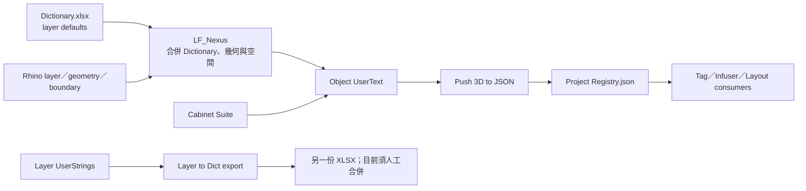

# LoopFlow 2.0 — Nexus／Dictionary 現況盤點與決策菜單

本文件記錄 1.0 程式與實際 Dictionary 的靜態盤點結果，作為欄位與 Nexus 細節的討論菜單。整條工作鏈與資料實體以 `LOOPFLOW_DATA_ECOSYSTEM.md` 為準；尚待確認的上位原則與實務語意以 `LOOPFLOW_DATA_ECOSYSTEM_DECISIONS.md` 為唯一編輯區。本文件後續會依已確認答案重排。它不是要沿用舊架構，也不代表所有現況都是正確規格。

## 盤點狀態

- 日期：2026-08-12
- 範圍：`releases/LoopFlow/Python/` 全部 23 支 Python、Dropbox 中文版 `LoopFlow_Dictionary.xlsx`、repo 英文舊版、繁中使用指南與 Dictionary 指南；另納入 9 份 Tag、1 份圖框的 Rhino Block 文字擷取與整體畫面
- 方法：逐檔閱讀、Python 靜態依賴搜尋、XLSX 結構與畫面檢查、Block UserText producer／consumer 對照
- 尚未執行：Rhino 指令端到端操作、舊專案資料抽樣、多人／雙機同時寫入測試；Block 文字與畫面已核對，不等同功能流程實機通過
- 結論：已足夠開始規格裁決；使用者確認關鍵語意前，不修改產品程式碼

## 現行資料流



目前不是單純「Excel 寫入物件」：部分欄位由 Dictionary 提供預設、部分由 Nexus 計算、部分保留物件既有值，Cabinet 又會另寫 `_CB.*`。因此重構前必須先固定欄位所有權。

## 已閱讀的 23 支 Python

| 檔案 | 現行責任 | 與 Nexus／Dictionary 的關係 |
|---|---|---|
| `_LoopFlow_Config.py` | 檔名、layer、顏色、Block、時間常數 | 設定與內部契約目前混在一起 |
| `_LF_Debug.py` | debug log | 多支程式各有 fallback，路徑策略未統一 |
| `_LF_Registry.py` | JSON、lock、replace | 接收 Nexus／Push 資料；並行安全不足 |
| `_LF_NamingRules.py` | Layout 與 Tag 命名規則 | 需與 canonical 名稱、Tag identity 一起定義 |
| `LF_Nexus.py` | Dictionary、layer、UUID、space、尺寸、高程、檢查、反向匯出與 UI | 主要整合點，也是目前責任衝突最多的檔案 |
| `LF_Dictionary_Editor.py` | 尋找並開啟 Dictionary | 路徑與缺檔流程相依 |
| `LF_Data_Viewer.py` | 檢視物件 UserText | 會直接暴露新舊 schema 差異 |
| `LF_Push_3D_to_JSON.py` | 將 M3D 物件推入 Registry | 依賴 `_03_*`、`_12_UUID` 與全部 UserText |
| `LF_Sync_Worksession.py` | Worksession 事件同步 | Registry 的讀寫與生命週期 consumer |
| `LF_Tagger_Grab.py` | 以選取目標建立 Tag 關聯 | 依賴 `_12_UUID`、Tag Block 欄位 |
| `LF_Tagger_Laser.py` | 以射線目標建立 Tag 關聯 | 依賴 `_03_*`、`_04_*`、`_12_UUID` |
| `LF_Tagger_Index.py` | 建立／更新 Index Tag | 依賴 Block 名稱、鎖定與 warning 契約 |
| `LF_Tagger_Layout_ID.py` | Layout ID Tag | 依賴 Layout 與 Tag identity |
| `LF_TAG-O.py` | Tag 檢查與更新 | 讀 Registry、`_01_*`、`Space_Name` 與顏色狀態 |
| `LF_Infuser_Part.py` | Registry 資料寫入部分 Tag | 依賴 `_03_*`、`_04_*`、`_10_*`、`_11_*` |
| `LF_Infuser_All.py` | 批次 Infuser | 繼承 Part 的資料與 last-good 行為 |
| `LF_Anchor_Frame.py` | 產生圖面 anchor | 依賴 layer 與後續 Layout 流程 |
| `LF_Extract_CP.py` | 建立剖面／可見線輸出 | 依賴 layer、顏色與 Rhino 狀態 |
| `LF_Duplicate_Layout.py` | 複製 Layout | 依賴命名、Tag 與 Registry mapping |
| `LF_Cabinet_Suite.py` | 產生櫃體及 `_CB.*` | 雖可延後重構，但欄位契約現在就要固定 |
| `LF_2D_DW_Gen.py` | 產生門窗 2D | 依賴 `20_DW` 特例與 2D layer |
| `LF_2D_Cabinet_Gen.py` | 產生櫃體 2D | 依賴 Cabinet 尺寸與 layer |
| `LF_2D_Shelf_Gap.py` | 產生層板間隙線 | 依賴 Cabinet 幾何與 2D layer |

## 實際 Dictionary 快照

重構採用 `%LOOPFLOW_WORKFILES_ROOT%\LoopFlow_Dictionary.xlsx`。公司電腦實際檔案為 `D:\Dropbox\LoopFlow_Series\Workfiles\WIP_loopflow\LoopFlow_Dictionary.xlsx`；repo release 內的英文版本只作比較。所選中文版的實際狀態：

- 工作表：`LoopFlow_Dictionary`
- 使用範圍：`A1:R94`
- 標題：`LoopFlow Dictionary v1.0`
- 資料列：92；`__Rhino Layer` 與 `_03_ID編號` 都沒有重複
- 欄位：18；沒有公式
- `_01`、`_05`、`_06`、`_07`、`_09`、`_11`、`_12` 與四個 `_CB` 欄目前全部留白
- 欄名採中文，例如 `_01_空間名稱`、`_02_建構狀態`、`_CB.01_板材類型`
- `_13_備註` 有 91 列為 `我是備註，UCCU`；`20_DW` 為正式操作說明
- 單位值實際包含 `cm`、`mm`、`m3`、`坪`、`座`、`才`、`樘`、`片`、`組`、`台`
- 沒有發現尾端空白值
- 高程基準實際包含 `BH`、`TH`、`BC`、`CH`、`TH/BH`

### 18 欄的現行所有權

| 欄位 | 現行來源／寫入者 | 主要 consumer | 現況問題 |
|---|---|---|---|
| `__Rhino Layer` | Dictionary；Layer to Dict 反向匯出 | Nexus、layer 建立、Push 範圍 | 選定版本為中英雙語 path；同時是顯示 path 與主鍵，`M3D::` 前綴由程式另加 |
| `_01_空間名稱` | Nexus 由 boundary 計算 | TAG-O 空間覆蓋 | boundary 實際用另一個 key `Space_Name`；重疊與樓層未定義 |
| `_02_建構狀態` | Dictionary 預設；物件既有值受保護 | 無已知行為 consumer | 重設與未來報表規則不明 |
| `_03_ID編號` | Dictionary | Push、Laser、Infuser、Tag | 92 筆皆為類別碼-序號；Infuser 以第一個 `-` 拆分 |
| `_04_ID名稱` | Dictionary | Laser、Infuser、Nexus 輔助 UI | 92 筆中並非唯一，只能作顯示名稱 |
| `_05_寬度W` | Nexus bbox 計算 | 無已知行為 consumer | 世界座標與物件局部方向未定義；儲存為字串 |
| `_06_深度D` | Nexus bbox 計算 | 無已知行為 consumer | 同上 |
| `_07_高度H` | Nexus bbox 計算 | 無已知行為 consumer | 同上 |
| `_08_單位` | Dictionary | 無已知行為 consumer | 是工程估算單位，不是 Rhino 模型單位 |
| `_09_實作數量` | 無 producer，只在缺值時補 `-` | 無已知行為 consumer | 指南稱 Nexus 計算，但程式不存在 |
| `_10_高程基準` | Dictionary | Nexus、Infuser | 同時承擔幾何規則與顯示標籤；`CH` 取底面，非 Block 的 `BC` 靜默退回底面 |
| `_11_高程計算` | Nexus | Infuser | 是帶 `+`／`±0`／`TH / BH` 的顯示字串，不是單純數值 |
| `_12_UUID` | Nexus | Push、Grab、Laser、Infuser、TAG-O | 重複時原件與複本都可能換號並切斷 Tag；需 mapping／rollback |
| `_13_備註` | Dictionary 預設；物件既有值受保護 | 無已知行為 consumer | 91 個 layer 的預設為 `我是備註，UCCU`，需確認是否只是測試字串 |
| `_CB.01_板材類型` | Cabinet；Nexus 條件保留或清為 `-` | 無已知行為 consumer | Cabinet layer 判定與實際生成位置可能不同 |
| `_CB.02_長度L` | Cabinet；Nexus 條件保留或清為 `-` | 無已知行為 consumer | 現況依尺寸排序，丟失已有 local direction |
| `_CB.03_寬度W` | Cabinet；Nexus 條件保留或清為 `-` | 無已知行為 consumer | 同上 |
| `_CB.04_厚度T` | Cabinet；Nexus 條件保留或清為 `-` | 無已知行為 consumer | 同上 |

完整 producer／consumer、非 Dictionary key 與無 consumer 項目，以整合後的 `LOOPFLOW_DATA_ECOSYSTEM.md` 為準。

## 設定盤點

### 目前 `_LoopFlow_Config.py` 的全部設定群

| 設定群 | 名稱 | 2.0 應有位置 |
|---|---|---|
| Dictionary 檔案 | `DICTIONARY_FILENAME_XLSX` | 專案設定；需決定是否允許改名 |
| Dictionary schema | `DICTIONARY_KEY_COLUMN`、`DICTIONARY_SKIPROWS` | 版本化內部契約，不應當一般偏好設定 |
| 3D taxonomy | `LAYER_PREFIX_3D`、`LAYER_DATA_SUFFIX`、`LAYER_SPACE_BOUNDARIES`、`LAYER_LEVEL_FFL`、`LAYER_LEVEL_FL`、`LAYER_DW_PLAN`、`LAYER_CABINET_PREFIX`、`LAYER_CABINET_NAME` | layer contract；不可只改一個字串期待自動遷移 |
| 2D／Extract taxonomy | `LAYER_PREFIX_2D`、`LAYER_EXTRACT_ROOT`、`LAYER_EXTRACT_VISIBLE`、`LAYER_EXTRACT_HATCH`、`LAYER_ANCHOR_FRAME`、`LAYER_ANCHOR` | layer contract |
| 2D layer／顏色 | `LAYER_2D_DW_*`、`COLOR_2D_DW_*`、`LAYER_2D_FURN_*`、`COLOR_2D_FURN_*`、`LAYER_2D_DEFPOINTS`、`COLOR_2D_DEFPOINTS` | layer contract 與可調顯示偏好需分開 |
| 欄位覆寫 | `WHITE_LIST` | schema 欄位所有權，不是使用者自由設定 |
| 系統檔名 | `REGISTRY_FILENAME`、`REGISTRY_LOCK_FILENAME`、`DEBUG_LOG_FILENAME` | path／storage contract；log 名可為進階設定 |
| Tag／圖框 Block | `INDEX_BLOCKS`、`HEIGHT_BLOCKS`、`FINISH_BLOCKS`、`DW_BLOCKS`、`ITEM_BLOCKS`；另有 `Sample_Frame` | Tag／title-frame schema 與資產 manifest；`TAG_DW` 已確認純手動，1.x 清單屬歷史衝突 |
| 系統顏色 | `COLOR_LAYER_MAP`、`COLOR_DATA_LAYER`、`COLOR_EXTRACT_VISIBLE`、`COLOR_EXTRACT_HATCH`、`COLOR_WARNING`、`COLOR_BROKEN` | layer 顯示與狀態顯示分開；warning 不可只靠顏色辨識 |
| Layout 規則 | `LAYOUT_NAME_SEPARATOR`、`LAYOUT_COPY_SUFFIX`、`LAYOUT_BASELINE_MARK`、`CEILING_KEYWORDS`、`MIRROR_KEYWORDS`、`INVERT_Y` | naming／layout contract；顯示偏好另分 |
| 並行／事件 | `SYNC_INTERVAL`、`LOCK_TIMEOUT`、`STALE_LOCK_SECONDS` | 系統內部預設與進階設定；安全機制不能只靠 timeout |

### 散落在 config 外的隱性設定

- 專案目錄的 `NamingRules_Config.json` 另行控制 separator、baseline、圖號／REF_ID 格式與 prefix pattern。
- Space 預設值 `EXT`、boundary 命中採「第一個」與 bottom-center 取樣點。
- 高程 slab 關鍵字、`200.0`、`2000.0`、`50.0`、`0.01`、`+1.0` 等容差與補正值。
- 尺寸小數一位、UUID4 uppercase、缺值 sentinel `-`。
- Registry fallback timeout 為 `8 / 120` 秒，與 config 的 `20 / 30` 秒衝突。
- Cabinet 自行 fallback `04_CB`、多組舊 `_CB` aliases、幾何尺寸與 Windows Python site-packages bridge。
- Tag 的 `Source_UUID`、`NAME_PARSED`、`.Auto_*`、`.Target_DV_ID`、`attr_*`、`Category`、`REF_ID`、`DWG_*` 等 Block 欄位。
- 正式 8 種可鎖 Block 共用 `attr_Lock_不更新>寫入x或X`，所以現行四支程式都找得到；但偵測條件散落，且只有單一 `x`／`X` 生效。鎖定同時擋 Infuser 與 Grab／Laser／Index 重新綁定。
- `LF_Cabinet_Suite.py` 的最終錯誤訊息仍寫死 `C:\_RH_Tools\cursor_LF_debug_log.txt`。

以上都不能在搬檔時原樣散落到新版；需歸入 schema、feature 規則或真正可調的 setting。

## 已確認的衝突與風險

| ID | 衝突／風險 | 影響 |
|---|---|---|
| CF-01 | repo release 是英文 Dictionary，Dropbox 另有同檔名中文版本；重構已指定 Dropbox 中文版 | resolver 若仍從 repo 或 Rhino 文件資料夾找檔，會讀到錯誤版本 |
| CF-02 | 程式常用 `_01_` 等 prefix 找第一欄，不依賴完整欄名 | 同 prefix 多欄時會靜默選錯；改字尾看似成功卻無 schema 保證 |
| CF-03 | 指南稱 layer 重複列會略過；程式 dict mapping 實際是後列覆蓋前列 | 資料錯誤不會被清楚阻擋 |
| CF-04 | 過往指南曾稱 `_09_Quantity` 由 Nexus 計算，但程式沒有 producer；繁中／英文指南已於 2026-08-13 修正 | 2.0 若要新增估算功能，仍需另定單位與幾何規則 |
| CF-05 | 過往指南曾把 `_11` 說成 cm 數字，但程式寫入顯示字串；繁中／英文指南已於 2026-08-13 修正 | 2.0 schema 仍須分開可計算數值與顯示格式 |
| CF-06 | 指南沒列 `BC`，實際 XLSX 與程式使用；`CH` 又沒有獨立算法 | 高程結果可能語意錯誤 |
| CF-07 | 中文 Dictionary 與 repo 英文 Dictionary 的單位、layer path、備註與欄名不同 | 兩者不可混用或依同檔名推定 schema |
| CF-08 | `_01_*` 與 boundary 的 `Space_Name` 是兩套 key | 空間名稱來源與更新責任不清楚 |
| CF-09 | Space 只看 bottom-center XY 且取第一個 boundary | 重疊空間、多樓層、跨界物件結果不穩定 |
| CF-10 | 一般幾何以 World bbox 算 W／D／H；Block 使用另一套算法 | 旋轉後的同一物件可能得到不同尺寸 |
| CF-11 | 高程包含單位不明的 magic numbers 與 layer／名稱推測 | 不同模型單位或建模方式會產生錯值 |
| CF-12 | UUID checker 掃描全模型，但 Push／TagTrigger 又只處理特定 scope | 非 M3D 物件可能使 M3D UUID 被重建 |
| CF-13 | Push 註解稱物件必須有 `_03_*`；實際缺欄仍可能 Push，只有值為 `-` 才跳過 | Registry 收錄範圍與使用者預期不同 |
| CF-14 | Push 以 UUID 建 dict；若沒先 TagTrigger，重複 UUID 會後者覆蓋前者 | 可能無警告遺失物件資料 |
| CF-15 | Registry lock 是先檢查再建立，非排他建立；replace fallback 會先刪目標 | 雙機或多程序可能覆寫、短暫失去 last-good |
| CF-16 | Config 說可調，但 import／reload 行為不一致；Registry fallback 值也漂移 | 修改後是否生效不可預測 |
| CF-17 | `Layer to Dict` 讀 layer UserStrings，不是指南所稱 object UserText | 反向同步名稱容易造成錯誤期待 |
| CF-18 | 反向匯出使用 `[NEW]`、`[DELETED]`、`[MODIFIED]`、`[EXCLUDED]` 混入主鍵 | 主鍵同時承擔狀態顯示，不利機器驗證 |
| CF-19 | `_02`、`_09`、`_13` 以 prefix 保護，只驗存在或沿用物件值 | Dictionary 更新後無明確的繼承、覆寫、重設方式 |
| CF-20 | 中文版 `_13` 有 91 列為 `我是備註，UCCU` | 可能把測試字串寫入大量正式物件與 Registry |
| CF-21 | Cabinet 產物可在 current layer，BOM 更新卻只處理 `04_CB`；Nexus 也靠 layer 判定 `_CB` | 已延後：Cabinet／BOM 移出主鏈，2.0 Nexus 不再處理 `_CB.*`，本衝突隨之離開核心資料鏈 |
| CF-22 | Infuser 把 `_03` 第一個 `-` 拆成兩個 Tag 值 | 一般 ID 若包含連字號會被誤解 |
| CF-23 | Tag lock、warning color 與缺值規則分散；正式 key 目前可共用，但非 `x/X` 值會靜默未鎖，locked Tag 又停止 health／顏色更新 | 重構單一 Tagger 時可能破壞其他 Tag 流程或讓使用者誤以為已保護 |
| CF-24 | Dictionary 沒有可執行的 `schema_version`、型別、允許值與 strict validator | 目前只能到執行中才發現格式問題 |
| CF-25 | `TAG_DW` 已改純手動且沒有 lock，仍在 `DW_BLOCKS`；Infuser 會把人工編號覆寫為 `?` | 1.x 全量同步可能破壞門窗編號；2.0 必須以 manual binding mode 排除 |
| CF-26 | `TAG_ITEM` 的 `FF-01__Chair-1` 來自 Block 名稱，不在 Dictionary 12 個類別碼內 | 同一 Tag 顯示欄有兩套未協調的編碼來源 |
| CF-27 | Layout ID 把所有未分類 Block 當圖框；`03-A3 Scale` 又把排序、圖幅與欄位語意混在 key | 未知 Block 可能被誤寫；圖幅變更可能迫使資料 key 改名 |

## 使用者決策菜單

以下是會改變使用方式或資料語意的決定，需由使用者裁決。建議分三輪討論，不必一次回答全部。

### 第一輪：先固定資料骨架

| ID | 要決定什麼 | 選項 | 建議 |
|---|---|---|---|
| ND-01 | 程式欄位 ID 與中英文顯示 | A. 固定英文 machine key，中文／英文只做顯示標籤；B. 完整中文 key；C. 保留任意字尾、只認 prefix | **A**；最適合穩定 schema 與多語文件 |
| ND-02 | Dictionary 的責任 | A. layer／類型的預設資料；B. 同時保存每個物件的即時資料；C. 只做 layer 清單 | **A**；物件即時資料留在 UserText／Registry |
| ND-03 | 欄位所有權 | A. 每欄固定 `dictionary_default / computed / object_override / external`；B. 繼續按程式分支猜測 | **A**；這是 Nexus 可拆分的前提 |
| ND-04a | Rhino 模型文件單位 | A. 固定 cm，非 cm 直接阻擋；B. 支援任意模型單位並明確換算 | 現行工具全部按 cm 設計但從未驗證；建議 **A**，仍待使用者確認 |
| ND-04b | `_08_單位` 與 `_09_實作數量` | A. 建立估算單位 enum 與單位→幾何量規則；B. `_09` 先定義為人工／外部值；C. 移除估算功能 | 這是工程估算單位，與 Rhino 單位無關；若算法未定，先 **B** |
| ND-05 | 缺值 | A. 內部使用 typed null，只有畫面／Tag 顯示 `-`；B. 所有層都保存 `-` 字串 | **A**；避免把缺值誤當真實文字或數字 |
| ND-06 | Dictionary 中的計算欄 | A. 保留欄位定義，但 row value 不作預設；B. 從 Dictionary 移除；C. 允許 row 預設覆寫計算 | **A**；schema 可見、所有權仍清楚 |
| ND-07 | Layer taxonomy | A. 採用目前 Dropbox 中文版的中英雙語 layer path；B. 改為英文 path、中文只顯示；C. 另訂新分類 | 已選定中文版作重構來源；仍須依 ECO-02 將 layer path 與穩定 Type ID 分離 |
| ND-08 | 專案檔案位置 | **已定案**：Dictionary 與即時交換 JSON 位於各專案的 Dropbox 工作檔根目錄，以環境變數解析；JSON 預設整理於 `exchange/` | 家中電腦使用相同變數名稱、不同實體路徑 |

### 第二輪：固定 Nexus 的核心語意

| ID | 要決定什麼 | 選項 | 建議 |
|---|---|---|---|
| ND-09 | Space identity | A. 穩定 Space ID + 顯示名稱；B. 只用名稱 | **A**；改名不會破壞關聯 |
| ND-10 | Space 命中 | A. boundary 有 priority／樓層，跨界時回報衝突；B. 取第一個；C. 取最大重疊 | 建議 **A**；需使用者說明實際 boundary 是否會重疊、是否多樓層 |
| ND-11 | 高程五種 basis | A. 分別正式定義 BH／TH／BC／CH／TH-BH；B. 刪除不用的 basis；C. 延續現況 | **A 或 B**；尤其要確認 `CH` 與非 Block 的 `BC` 應代表什麼 |
| ND-12 | 高程 datum | A. boundary 用結構化 UserText 儲存 datum／type／level ID；B. 從 ObjectName 解析數字 | **A**；ObjectName 只作顯示，不承擔數值資料 |
| ND-13 | W／D／H 方向 | A. 依物件 local frame／類型規則；B. 固定 World XYZ；C. 單純由三邊排序 | 建議 **A**；需確認不同物件類型的「寬、深、高」實務定義 |
| ND-14 | UUID 範圍與複製 | A. 專案全域唯一，複製產生新 UUID；B. 只在每個 `.3dm` 唯一；C. 複製保留 UUID | 建議 **A**；Tag／Registry 的跨檔關聯需另用 mapping |
| ND-15 | Construction Status | A. Dictionary 給預設、物件可 override，並提供 Reset to default；B. Dictionary 每次強制覆寫；C. 只由物件維護 | 建議 **A** |
| ND-16 | Quantity | A. 現在定義計算規則；B. schema 先保留但明確標為人工／外部值；C. 2.0 移除 | 若尚無可靠算法，建議 **B**，不再宣稱 Nexus 會計算 |
| ND-17 | Remarks 預設 | A. 預設空白；B. 保留 `我是備註，UCCU`；C. 每個 Type 另訂正式備註 | 建議 **A**；`20_DW` 的正式操作說明可另設 instruction 欄位 |

### 第三輪：固定下游交換與延後功能的邊界

| ID | 要決定什麼 | 選項 | 建議 |
|---|---|---|---|
| ND-18 | Registry payload | A. 版本化 typed schema + 明確 extension 區；B. 將全部 UserText 原樣快照 | **A**；避免任意欄位變成永久 API |
| ND-19 | `_03` 與家具 `FF-01` 的 Tag 語意 | A. Dictionary 類別碼／序號拆成 typed 欄位，家具另依 ED-14 定義 namespace；B. 全部固定同一連字號字串；C. 不再拆分 | 92 筆 Dictionary 資料與 Infuser 已確認兩段語意；家具 Block 又是第二套來源。建議 **A**，並先回答 ED-14 |
| ND-20 | Tag 鎖定欄位 | A. 單一 canonical boolean／enum，由 UI 切換；B. 繼續讓使用者輸入文字 | **A**；現行正式 key 可被四支程式辨認，但只有單一 `x/X` 生效。舊 key／其他值只由 migration 列為待確認 |
| ND-21 | `Layer to Dict` | A. 明確只匯出 layer defaults，另做 object data export；B. 改為彙總 object UserText；C. 取消反向匯出 | 建議 **A**；避免 layer 與 object 資料混為一談 |
| ND-22 | `20_DW` 特例 | A. 保留單一 DW 類型及 child-layer 排除規則；B. 每個 DW child 都進 Dictionary；C. 重新分類 | 需依目前門窗工作方式決定 |
| ND-23 | Cabinet `_CB.*` | A. 現在凍結四欄語意，程式延後；B. 等 Cabinet 重構時再決定 | **已裁決為 B**：Cabinet／BOM 移出主鏈，2.0 Nexus／Registry 完全不處理 `_CB.*`，四欄語意留給 Cabinet 工作軌 |
| ND-24 | Cabinet 方向 | A. L／W／T 依 panel local frame；B. 依三邊大小排序；C. 依 current layer／類型各自規則 | 技術上仍建議 **A**（`make_part()` 已持有 true W／H／D，只在寫入前被排序抹除），但**已延後**到 Cabinet 工作軌，不阻擋核心契約 |
| ND-25 | Dictionary 驗證強度 | A. 重複、未知欄、錯型別、錯單位直接阻擋並列清單；B. 警告後盡量執行 | 核心欄位建議 **A**；未知 extension 可另設允許區 |

## 不需要使用者逐項選擇的技術修正

下列不改變業務語意，已由重構原則決定，後續可直接列入實作與測試：

- Dictionary、Registry 都加入 `schema_version`，未知版本停止處理。
- Dictionary loader 檢查重複欄、重複 layer、必要欄、型別、允許值與尾端空白。
- Registry 改用真正排他 lock、pending 檔、validate、atomic replace 與 last-good 保護。
- 所有讀取操作避免在 constructor 產生寫入副作用。
- config fallback 只保留一個來源；所有入口有一致的 reload／啟動規則。
- 重複 UUID、未知 layer、略過物件都要列入可見報告，不再靜默覆蓋。
- ID 變更先預覽、保留一方、列出受影響 Tag，並保存舊新 mapping 供復原。
- warning 狀態使用資料欄位，不以 Rhino 物件顏色作唯一真相；清除 warning 不破壞使用者原色。
- 每個會產生幾何或改寫資料的指令定義冪等重跑政策，並復原 layer／selection／visibility 等 Rhino 狀態。
- 硬編碼 debug 路徑、散落 magic numbers 與寬鬆 `except` 逐 feature 收斂。
- 舊欄位 alias、舊 Tag key 與舊 layer 名只由 migration scanner 辨識，不進入 2.0 日常核心。

## 建議討論順序與開始寫程式的門檻

1. 先裁決 ND-01～ND-08，固定 schema、單位、缺值、layer 與檔案責任。
2. 再裁決 ND-09～ND-17，完成 Space、Elevation、Dimension、UUID 與欄位所有權。
3. 最後裁決 ND-18～ND-25，固定 Registry、Tag、DW 與 Cabinet 的介面。
4. 將答案正式寫入 `_LoopFlow_命名與資料契約.md`，再建立 schema fixtures 與 validator 測試資料。
5. 上述契約確認後，另建 Nexus 詳細拆分文件；此時才開始 2.0 程式骨架與功能實作。

回覆時可以只處理一輪，格式例如：

```text
ND-01=A
ND-02=A
ND-04a=A（所有專案固定 cm）
ND-04b=B（數量先作人工／外部值）
ND-07=A
```

未回答的項目維持「待決定」，不由 AI 自行猜測。
