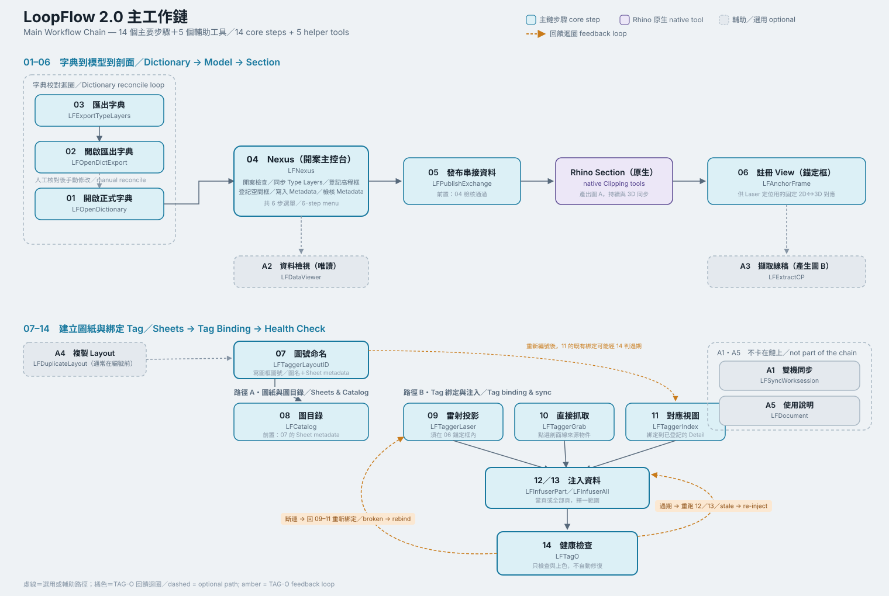

# LoopFlow 2.0 使用說明總覽

> 一分鐘理解 LoopFlow 怎麼運作。操作細節見 [指令逐項說明](./COMMANDS_TW.md)；Excel 字典見 [字典使用說明](./Dictionary_GUIDE_TW.md)；圖面上的 Tag 圖塊欄位見 [Tag Block 說明](./TAG_BLOCKS_TW.md)。

下面這張圖是整套邏輯的濃縮版；本頁文字是它的延伸說明，講得比圖更細一點，但重點還是「邏輯」，不是操作步驟。

## 核心邏輯：三段式

**先自由建模，再由字典灌入資料，最後銜接給 2D 使用。**

1. **3D 自由建模**：在 Rhino 裡照一般方式建模，LoopFlow 不會在背景偷偷寫入任何東西，也不限制怎麼畫。
2. **字典灌入資料**：Excel 字典定義每種材質／工項的預設值，同步成 Rhino 圖層；模型建好後，把物件放進對應圖層，就能把這些資料寫入每個物件（ID、材質、高程、空間…）。
3. **發布，銜接 2D**：資料檢核通過後，發布成一份唯讀的 **Registry**。它是模型資料從 3D 交給 2D 的正式快照；2D Tag 依指定版次讀取 Type、高程與空間等資料。

模型資料是單向流動：**3D 決定模型物件資料，Registry 固定一次通過檢核的版本，2D 不反向改寫 3D Type 或物件**。但 2D 不是被動輸出：Sheet 圖號／圖名、Tag 綁定、Detail 編號、備註與其他人工欄位，仍由圖面端自己維護。3D 之後若有變動，只需回到受影響的節點，重新寫入、檢核、發布與注入，不必推翻整份圖面。

## 2D／3D 的分界在哪裡：Rhino Section

LoopFlow 沒有自己另外做一套剖面工具，2D 幾何流程建立在 **Rhino 8 原生的 Section／Clipping Drawing** 之上。這一步是 3D 與 2D 的主要幾何分界：

- **分界線之前**：都是 3D 世界——自由建模、空間規劃、資料化、發布，全部發生在模型裡。
- **分界線之後**：都是 2D 世界——剖面產生後，接下來的圖紙編號、Tag 綁定、資料顯示，做的是「怎麼把已經存在的資料整理成圖面」，不是重新建立幾何或重新定義資料。使用者仍然決定要建立哪些 View、怎麼編排 Layout、Tag 要不要鎖定——2D 端不是全自動產出物。

| 3D 模型端 | Rhino Section | 2D 圖面端 |
|---|---|---|
| 自由建模與 Type Layers | 產生可更新的平面、立面或剖面 | 登記 View 與 2D↔3D 對應 |
| 空間、高程、UUID、資料版次 | 傳遞幾何，不重新定義模型資料 | Drawing、Layout、Sheet 與圖框 |
| 檢核並發布 Registry | 作為幾何出口 | Tag 綁定、注入與人工欄位 |

換句話說：**3D 是模型資料的產地，Registry 是資料快照，Section 是幾何出口，2D 是編排與人工判斷的工作區。**

## 整條流程可回溯、可暫停

這是 LoopFlow 的設計前提，不是附加規則：

- **每個節點都是安全停點**。字典同步完可以先存檔、資料寫入模型後可以先存檔、剖面登記完可以先存檔——不必一次跑到底，中間隨時能停下來，換人接手或換電腦都不會弄丟已完成的部分。
- **系統不會自己往下動作**，每一步都要使用者主動執行；有影響範圍的動作（例如發布、寫入）會先讓使用者看到會改什麼，而不是直接改完再說。
- **走錯不會波及其他部分**。哪個環節的資料跟不上了（來源被改、被刪），系統只會標記提醒，不會自動修、也不會連帶弄壞其他已經做好的東西——回到對應的節點重新處理就好，其他部分不受影響。
- **1.x 與 2.0 是兩套不同架構，不可混用**——同一份檔案、同一套按鈕不要混著用。

## 四個常聽到、要先懂的名詞

| 名詞 | 意思 |
|---|---|
| **Dictionary** | Type Catalog。定義穩定 Type ID、Layer、顯示名稱、初始預設與規則，不保存每個 3D 物件的現況。 |
| **Registry** | 3D 端發布的唯讀模型資料快照，讓 2D 知道自己讀取哪一次 revision；不是給人手動編輯的資料庫。 |
| **Sheet** | 圖號、圖名、版次資料的真正來源；Layout 頁名只是顯示結果，不是身分本身。 |
| **Health** | Tag 的正常、過期或斷連檢查結果。顏色是可復原提示；重新注入或重新綁定後即可恢復。 |

## 想知道怎麼操作

這一頁只講邏輯。實際指令怎麼按、Nexus 選單每一步在做什麼、Excel 字典欄位怎麼填、圖面上 Tag 的每個欄位是誰寫的，請分別查 [指令逐項說明](./COMMANDS_TW.md)、[字典使用說明](./Dictionary_GUIDE_TW.md)、[Tag Block 說明](./TAG_BLOCKS_TW.md)。
