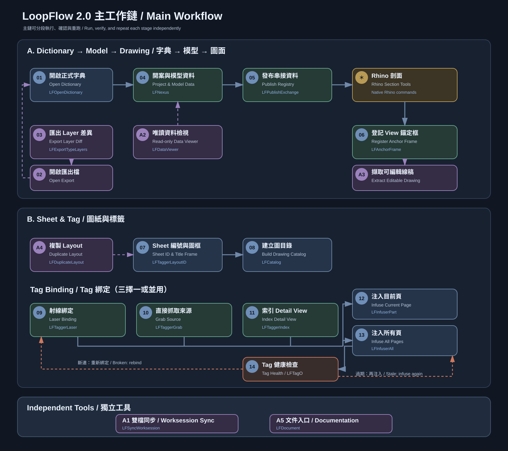

# LoopFlow 2.0 使用說明

LoopFlow 2.0 把 Rhino 8 裡的 Type Dictionary、3D 模型資料、剖面、Layout、Tag 與圖面檢查接成一條可分段操作的工作鏈。每個階段都能單獨執行、確認、存檔與重跑；LoopFlow 不會把整套工作變成不可中斷的一鍵自動化。

> **版本隔離**
>
> LoopFlow 1.x 與 2.0 不可混用。請勿在同一份 3dm、同一套工具列或同一次工作流程中交替使用兩個版本。

## 文件導覽

- **本頁**：工作流程、開始順序與共同觀念
- [Excel Dictionary](./DICTIONARY_TW.md)：Type Catalog 的編輯方式，以及 Dictionary、Rhino Layer、3D 物件與 Registry 的關係
- [Rhino 指令](./COMMANDS_TW.md)：完整工具鏈與每支指令的操作方式
- [Tag Blocks](./TAG_BLOCKS_TW.md)：Tag_Blocks.3dm 內各種圖塊的內容、綁定方式與適用範圍

## 系統需求

- Rhino 8
- Windows
- Rhino 文件單位建議使用公分（cm）；其他單位會收到風險警告
- 已完成 LoopFlow 2.0 安裝與工作檔根目錄設定
- 正式 Dictionary 可被目前 3dm 找到

## 主工作鏈 / Main Workflow

下圖中的中文與英文放在同一張 SVG，繁中與英文文件共用，不維護兩份流程邏輯。

## 如何開始一個專案

1. 確認目前使用的是 LoopFlow 2.0 工具列。
2. 開啟 3dm，執行 **LFNexus** 的「開案檢查」。
3. 確認專案身分、Dictionary、工作檔路徑與模型單位。
4. 視需要用 **LFOpenDictionary** 編輯正式 Dictionary。
5. 在 **LFNexus** 同步 Type Layers。
6. 建立 3D 模型，登記高程框與空間框。
7. 寫入模型 Metadata，再執行檢核。
8. 檢核通過後，以 **LFPublishExchange** 發布 Registry revision。
9. 使用 Rhino Section 建立剖面，並以 **LFAnchorFrame** 登記 View。
10. 建立 Layout、圖框與 Tag，再依工作需求完成編號、綁定、注入與健康檢查。

## 工作鏈分段

### 1. Dictionary 與模型

Dictionary 是 Type Catalog：它定義每一種 Type 的穩定 ID、顯示名稱、Rhino Layer、建構狀態預設、高程基準及後續計量規則。

3D 物件則保存 instance 現值，例如物件 UUID、空間、實際高程、人工備註與資料版次。重新同步 Dictionary 不會把 instance 的人工修改當成 Type 預設覆寫。

詳細規則見 [Excel Dictionary](./DICTIONARY_TW.md)。

### 2. 發布模型資料

完成 Metadata 寫入與檢核後，使用 **LFPublishExchange** 發布新的 Registry revision。Registry 是驗證後的唯讀快照，供 Tag 注入與跨檔工作使用；它不是第二份人工維護的資料庫。

發布失敗不會先刪除上一份有效資料。若正式檔不可用，部分讀取功能可依規則退回 last-good。

### 3. 剖面、View 與可編輯 Drawing

Rhino Section 產生的同步剖面可視為圖面 A。使用 **LFAnchorFrame** 登記固定的 2D↔3D 對應，供 Laser Tag 定位。

需要人工編修線稿時，可用 **LFExtractCP** 產生離線的圖面 B。圖面 B 可以移動與編修；更新時 LoopFlow 不會靜默覆寫已標為人工修改的成果。

### 4. Sheet 與圖目錄

**LFTaggerLayoutID** 依 Layout 名稱規則建立 Sheet metadata，並把圖號與圖名寫入已登錄圖框。Sheet metadata 才是圖號、圖名與頁面身分的真相，Layout 名稱只是可讀輸出。

完成 Sheet metadata 後，才能用 **LFCatalog** 建立圖目錄。

### 5. Tag 綁定與注入

Tag 依資料來源使用三種綁定方式：

- **Grab**：直接選取來源物件、剖面線或家具圖塊
- **Laser**：從已登記 View 的剖面位置射線尋找 3D 物件
- **Index**：綁定其他 Layout 裡的 Detail View

綁定只建立關係，不直接填滿畫面文字。完成綁定後，再以 **LFInfuserPart** 更新目前頁，或用 **LFInfuserAll** 更新所有 Layout。

各圖塊適用的指令見 [Tag Blocks](./TAG_BLOCKS_TW.md)。

### 6. TAG-O 健康檢查

**LFTagO** 檢查已綁定 Tag：

| 狀態 | 畫面 | 意義 | 處理方式 |
|---|---|---|---|
| 正常 | 綠色狀態 | 綁定與顯示資料一致 | 不需處理 |
| 過期 | 橘色、顯示 <code>!</code> | 來源仍存在，但畫面不是最新版 | 再執行 Infuser |
| 斷連 | 紅色、顯示 <code>?</code> | 來源物件、目標頁或 Detail 已消失 | 重新 Grab／Laser／Index，再執行 Infuser |
| 未綁定 | 顯示 <code>-</code> | 尚未建立來源 | 完成適用的綁定 |

TAG-O 只檢查與上色，不會自動修復。

## 何時使用獨立工具

- **LFDataViewer**：隨時唯讀查看物件資料
- **LFExportTypeLayers**：需要比較 Rhino Type Layers 與正式 Dictionary 時
- **LFDuplicateLayout**：大量建立相似 Layout，通常在 Layout ID 編號之前
- **LFSyncWorksession**：雙檔或雙機工作時，自動 Refresh 同資料夾的 Worksession 參照
- **LFDocument**：開啟本文件入口

## 取消、失敗與重跑

- 在確認前取消，應維持零寫入。
- 指令失敗時，不應破壞上一份有效 Registry、Worksession 參照或人工 Drawing。
- 產生內容的指令會辨識前次成果，依功能提供取代、新增或略過。
- LoopFlow 不會因位置相近就猜測永久身分；來源有歧義時會停止並要求使用者選擇或修正。

## 2.0 不包含的功能

- Cabinet Suite 與 BOM
- 2D Cabinet Gen、2D Shelf Gap、2D DW Gen
- Grasshopper Quantity 計算
- 自動 Tag Repair
- 1.x 專案直接升級或與 2.0 混用

Dictionary 中的 <code>04_CB_櫃體</code> 仍是一般材質 Type 群組，不代表 Cabinet 工具屬於 LoopFlow 2.0。

## 下一步

- 要新增或調整 Type：[Excel Dictionary](./DICTIONARY_TW.md)
- 要查某支指令：[Rhino 指令](./COMMANDS_TW.md)
- 要選擇或填寫 Tag：[Tag Blocks](./TAG_BLOCKS_TW.md)
- 回到[文件入口](./README.md)
